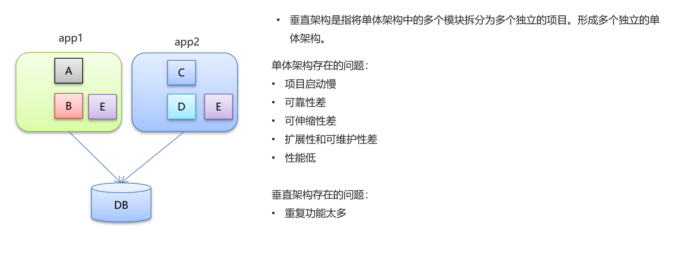
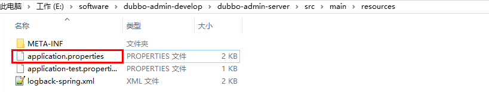
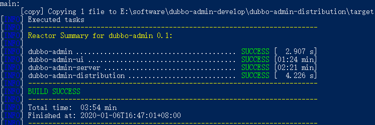
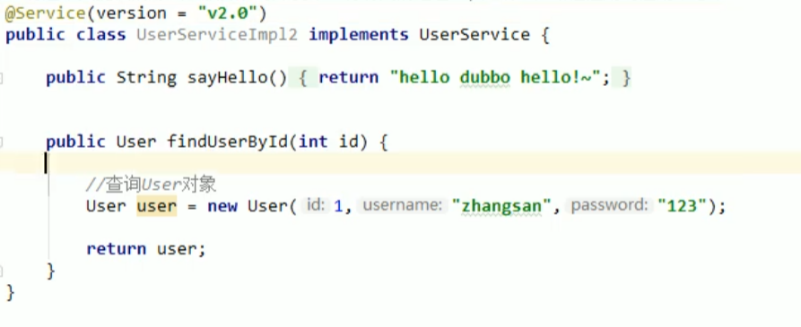
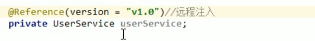

:::tip

Apache Dubbo 是一款 RPC 服务开发框架，用于解决微服务架构下的服务治理与通信问题，官方提供了 Java、Golang 等多语言 SDK 实现。使用 Dubbo 开发的微服务原生具备相互之间的远程地址发现与通信能力， 利用 Dubbo 提供的丰富服务治理特性，可以实现诸如服务发现、负载均衡、流量调度等服务治理诉求。Dubbo 被设计为高度可扩展，用户可以方便的实现流量拦截、选址的各种定制逻辑。

:::

<!-- more -->


:::danger

今天是个好日子，虽说下星期就要考试，但是受命于危难之间，奉命于败军之寄，今晚我就要干完你这个dubbo，我要利用这晚上3个小时学完外加一把lol嗷

:::

# 分布式系统架构演进


## 单体架构


## 垂直架构



## 分布式架构


## SOA架构


## 微服务架构


> Dubbo 是 SOA时代的产物，SpringCloud 是微服务时代的产物,但是如今还有许多公司在使用dubbo，而且了解dubbo对于学习理解springcloud有一定帮助。

# Dubbo概述

## Dubbo概念

•Dubbo是阿里巴巴公司开源的一个高性能、轻量级的 Java RPC 框架。

•致力于提供高性能和透明化的 RPC 远程服务调用方案，以及 SOA 服务治理方案。

•官网：[http://dubbo.apache.org](http://dubbo.apache.org/)

## Dubbo架构


节点角色说明：

- Provider：暴露服务的服务提供方
- Container：服务运行容器
- Consumer：调用远程服务的服务消费方
- Registry：服务注册与发现的注册中心

- Monitor：统计服务的调用次数和调用时间的监控中心

# Dubbo快速入门

## Zookeeper安装

（dubbo官方推荐的一个Registry）

•Dubbo官方推荐使用Zookeeper作为注册中心

### 1.1 下载安装

**1、环境准备**

ZooKeeper服务器是用Java创建的，它运行在JVM之上。需要安装JDK 7或更高版本。

**2、上传**

将下载的ZooKeeper放到/opt/ZooKeeper目录下

```shell
#上传zookeeper alt+p
put f:/setup/apache-zookeeper-3.5.6-bin.tar.gz
#打开 opt目录
cd /opt
#创建zooKeeper目录
mkdir  zooKeeper
#将zookeeper安装包移动到 /opt/zooKeeper
mv apache-zookeeper-3.5.6-bin.tar.gz /opt/zookeeper/
```

**3、解压**

将tar包解压到/opt/zookeeper目录下

```shell
tar -zxvf apache-ZooKeeper-3.5.6-bin.tar.gz 
```

### 1.2 配置启动

**1、配置zoo.cfg**

进入到conf目录拷贝一个zoo_sample.cfg并完成配置

```shell
#进入到conf目录
cd /opt/zooKeeper/apache-zooKeeper-3.5.6-bin/conf/
#拷贝
cp  zoo_sample.cfg  zoo.cfg
```


修改zoo.cfg

```shell
#打开目录
cd /opt/zooKeeper/
#创建zooKeeper存储目录
mkdir  zkdata
#修改zoo.cfg
vim /opt/zooKeeper/apache-zooKeeper-3.5.6-bin/conf/zoo.cfg
```


修改存储目录：dataDir=/opt/zookeeper/zkdata

**2、启动ZooKeeper**

```shell
cd /opt/zooKeeper/apache-zooKeeper-3.5.6-bin/bin/
#启动
 ./zkServer.sh  start
```


看到上图表示ZooKeeper成功启动

**3、查看ZooKeeper状态**

```shell
./zkServer.sh status
```

zookeeper启动成功。standalone代表zk没有搭建集群，现在是单节点


zookeeper没有启动


## Dubbo快速入门

### 未使用Dubbo时

未使用dubbo远程调用时，web模块依赖service模块。@service注解（这时是spring包下的）把userservice类添加到ioc容器中，然后web模块本地调用该service服务，不能够远程调用其他模块，并且每个模块不能独立运行：


### 使用Dubbo后

而使用dubbo后可以通过把UserServiceImpl发布给dubbo，dubbo记录到zookeeper里，这样就把服务提供者添加到了注册中心，供服务消费者消费：

#### 架构图


#### 创建服务提供者

1. 我们用org.apache.dubbo包下的@Service注解代替Spring包下的@Service注解即可，注意2.7版本以后@Service过时，可以用@DubboService代替了。然后再重新配置service项目的applicationContext.xml

```xml
<?xml version="1.0" encoding="UTF-8"?>
<beans xmlns="http://www.springframework.org/schema/beans"
	   xmlns:xsi="http://www.w3.org/2001/XMLSchema-instance"
	   xmlns:dubbo="http://dubbo.apache.org/schema/dubbo" xmlns:context="http://www.springframework.org/schema/context"
	   xsi:schemaLocation="http://www.springframework.org/schema/beans http://www.springframework.org/schema/beans/spring-beans.xsd
        http://dubbo.apache.org/schema/dubbo http://dubbo.apache.org/schema/dubbo/dubbo.xsd http://www.springframework.org/schema/context https://www.springframework.org/schema/context/spring-context.xsd">

	<!--<context:component-scan base-package="com.itheima.service" /> -->
    <!-- 使用dubbo后就不用spring来帮我们扫描service类了 -->

	<!--dubbo的配置-->
	<!--1.配置项目的名称,唯一-->
	<dubbo:application name="dubbo-service"/>
	<!--2.配置注册中心的地址-->
	<dubbo:registry address="zookeeper://192.168.137.128:2181"/>
	<!--3.配置dubbo包扫描-->
	<dubbo:annotation package="com.itheima.service.impl" />

</beans>
```

2. 最后需要把service配置成一个web项目，也就是配置web.xml，把web模块中的web.xml复制过来，然后把springmvc配置删除即可

```xml
<?xml version="1.0" encoding="UTF-8"?>
<web-app xmlns:xsi="http://www.w3.org/2001/XMLSchema-instance"
         xmlns="http://java.sun.com/xml/ns/javaee"
         xsi:schemaLocation="http://java.sun.com/xml/ns/javaee http://java.sun.com/xml/ns/javaee/web-app_2_5.xsd"
         version="2.5">

		 
	<!-- spring -->
    <context-param>
        <param-name>contextConfigLocation</param-name>
        <param-value>classpath*:spring/applicationContext.xml</param-value>
    </context-param>
    <listener>
        <listener-class>org.springframework.web.context.ContextLoaderListener</listener-class>
    </listener>


</web-app>
```

#### 创建服务消费者

我们直接在原来web模块的基础上把@Autowired注解改为@Reference注解就行（2.7后过时，建议使用@DubboReference代替），并且配置springmvc.xml中的Dubbo配置

1. 修改Controller类

```java
@RestController
@RequestMapping("/user")
public class UserController {

    //注入Service
    //@Autowired//本地注入

    /*
        1. 从zookeeper注册中心获取userService的访问url
        2. 进行远程调用RPC
        3. 将结果封装为一个代理对象。给变量赋值

     */

    @Reference//远程注入
    private UserService userService;


    @RequestMapping("/sayHello")
    public String sayHello(){
        return userService.sayHello();
    }

}
```

2. 配置springmvc.xml

```xml
<?xml version="1.0" encoding="UTF-8"?>
<beans xmlns="http://www.springframework.org/schema/beans"
       xmlns:xsi="http://www.w3.org/2001/XMLSchema-instance"
       xmlns:dubbo="http://dubbo.apache.org/schema/dubbo"
       xmlns:mvc="http://www.springframework.org/schema/mvc"
       xmlns:context="http://www.springframework.org/schema/context"
       xsi:schemaLocation="http://www.springframework.org/schema/beans http://www.springframework.org/schema/beans/spring-beans.xsd
        http://www.springframework.org/schema/mvc http://www.springframework.org/schema/mvc/spring-mvc.xsd
         http://dubbo.apache.org/schema/dubbo http://dubbo.apache.org/schema/dubbo/dubbo.xsd http://www.springframework.org/schema/context https://www.springframework.org/schema/context/spring-context.xsd">

    <mvc:annotation-driven/>
    <context:component-scan base-package="com.itheima.controller"/>


    <!--dubbo的配置-->
    <!--1.配置项目的名称,唯一-->
    <dubbo:application name="dubbo-web" />
   
    <!--2.配置注册中心的地址-->
    <dubbo:registry address="zookeeper://192.168.149.135:2181"/>
    <!--3.配置dubbo包扫描-->
    <dubbo:annotation package="com.itheima.controller" />

</beans>
```

3. 配置完成之后我们发现还会存在一个错误，也就是**需要注入的接口处还在报错**，这是因为我们虽然设置了要注入ServiceImpl类，但是**接口在我们web模块不存在**，我们既没不能通过服务调用注入，也没有在本地引用Service接口。这里有两种解决方法，第一种方法：在web模块创建UserService接口，但是这种方法如果是在很大的模块中，那岂不是每个需要使用UserService接口的地方都要重新定义一次UserService接口了。所以就出现了第二种方法：**创建一个新的模块，专门来定义接口，然后让我们需要使用UserService接口的模块里都在pom文件里引入这个模块**，然后重新导包即可调用


重新导包后


然后运行项目，先运行service模块，把服务注册到zookeeper里，再启动web模块，通过地址访问消费服务。但是这时我们发现控制台打印出错误：


这个其实是Dubbo的监控服务占用了同一个端口，因为我们启动了两个Dubbo服务，一个是web的，一个是service的，这个端口是用来监控服务访问情况的，但是两个监控在同一个端口冲突了，我们只需要修改其中某一个监控服务的端口为其他值就行了,我们这里在web模块修改。

```xml
<?xml version="1.0" encoding="UTF-8"?>
<beans xmlns="http://www.springframework.org/schema/beans"
       xmlns:xsi="http://www.w3.org/2001/XMLSchema-instance"
       xmlns:dubbo="http://dubbo.apache.org/schema/dubbo"
       xmlns:mvc="http://www.springframework.org/schema/mvc"
       xmlns:context="http://www.springframework.org/schema/context"
       xsi:schemaLocation="http://www.springframework.org/schema/beans http://www.springframework.org/schema/beans/spring-beans.xsd
        http://www.springframework.org/schema/mvc http://www.springframework.org/schema/mvc/spring-mvc.xsd
         http://dubbo.apache.org/schema/dubbo http://dubbo.apache.org/schema/dubbo/dubbo.xsd http://www.springframework.org/schema/context https://www.springframework.org/schema/context/spring-context.xsd">

    <mvc:annotation-driven/>
    <context:component-scan base-package="com.itheima.controller"/>


    <!--dubbo的配置-->
    <!--1.配置项目的名称,唯一-->
    <dubbo:application name="dubbo-web" >
        <dubbo:parameter key="qos.port" value="33333"/> <!-- 修改监控服务端口为33333-->
    </dubbo:application>
    <!--2.配置注册中心的地址-->
    <dubbo:registry address="zookeeper://192.168.149.135:2181"/>
    <!--3.配置dubbo包扫描-->
    <dubbo:annotation package="com.itheima.controller" />

</beans>
```

最后再次启动项目，成功访问（第一次访问可能比较慢，实际项目中我们都需要进行一个”预热“的操作）：


# Dubbo高级特性

## dubbo-admin管理平台

Dubbo官方认为Monitor角色的功能并没有设计的很好，我们通过dubbo-admin这个平台也可以起到监控服务的作用，并且做得比Monitor更好

### dubbo-admin介绍

- dubbo-admin 管理平台，是**图形化的服务管理页面**
- 从注册中心中获取到所有的提供者 / 消费者进行配置管理
- 路由规则、动态配置、服务降级、访问控制、权重调整、负载均衡等管理功能
- dubbo-admin 是一个前后端分离的项目。前端使用vue，后端使用springboot
- 安装 dubbo-admin 其实就是部署该项目

### dubbo-admin安装

**1、环境准备**

dubbo-admin 是一个前后端分离的项目。前端使用vue，后端使用springboot，安装 dubbo-admin 其实就是部署该项目。我们将dubbo-admin安装到开发环境上。要保证开发环境有jdk，maven，nodejs

安装node，这里我们安装到windows上**(如果当前机器已经安装请忽略)**

因为前端工程是用vue开发的，所以需要安装node.js，node.js中自带了npm，后面我们会通过npm启动

下载地址

```
https://nodejs.org/en/
```

下载msi文件一直点next


**2、下载 Dubbo-Admin**

进入github，搜索dubbo-admin

```
https://github.com/apache/dubbo-admin
```

下载：


**3、把下载的zip包解压到指定文件夹(解压到那个文件夹随意)**


**4、修改配置文件**

解压后我们进入…\dubbo-admin-develop\dubbo-admin-server\src\main\resources目录，找到 **application.properties** 配置文件 进行配置修改



修改zookeeper地址


```shell
# centers in dubbo2.7
admin.registry.address=zookeeper://192.168.137.128:2181
admin.config-center=zookeeper://192.168.137.128:2181
admin.metadata-report.address=zookeeper://192.168.137.128:2181

```

admin.registry.address注册中心
admin.config-center 配置中心
admin.metadata-report.address元数据中心

**5、打包项目**

在 dubbo-admin-develop 目录执行打包命令

```shell
mvn  clean package
```



此过程遇到的问题：
1、dubbo-admin-ui打包失败，
解决办法是在dubbo-admin-develop\dubbo-admin-ui目录下打开shell窗口
运行 npm install --registry=https://registry.npm.taobao.org 命令
2、服务查询元数据有问题，需要dubbo admin项目下pom里面的dubbo version和开发的项目中pom的dubbo version保持一致

**6、启动后端**

切换到目录

```shell
dubbo-Admin-develop\dubbo-admin-distribution\target>
```

执行下面的命令启动 dubbo-admin，dubbo-admin后台由SpringBoot构建。

```shell
java -jar .\dubbo-admin-0.1.jar
```

**7、前台后端**

dubbo-admin-ui 目录下执行命令

```shell
npm run dev
```


**8、访问**

浏览器输入。用户名密码都是root

```
http://localhost:8081/
```


### dubbo-admin简单使用

#### 服务查询功能


注意:Dubbo Admin【服务Mock】【服务统计】将在后续版本发布....

在上面的步骤中，我们已经进入了Dubbo-Admin的主界面，在【快速入门】章节中，我们定义了服务生产者、和服务消费者，下面我们从Dubbo-Admin管理界面找到这个两个服务

**1、点击服务查询**


**2、查询结果**


A:输入的查询条件com.itheima.service.UserService

B:搜索类型，主要分为【按服务名】【按IP地址】【按应用】三种类型查询

C:搜索结果

**3.1.4 dubo-admin查看详情**

我们查看com.itheima.service.UserService （服务提供者）的具体详细信息，包含【元数据信息】

**1）点击详情**

从【详情】界面查看，主要分为3个区域

A区域：主要包含服务端 基础信息比如服务名称、应用名称等

B区域：主要包含了生产者、消费者一些基本信息

**C区域：是元数据信息，注意看上面的图,元数据信息是空的**

我们需要打开我们的生产者配置文件加入下面配置才能显示元数据

```xml
    <!-- 元数据配置 -->
    <dubbo:metadata-report address="zookeeper://192.168.137.128:2181" />
```

重新启动生产者，再次打开Dubbo-Admin

这样我们的元数据信息就出来了


#### 服务测试

我们不用提供服务消费者，只要在写完服务生产者之后，就可以在这里测试这个服务


 


## dubbo常用高级配置

### 序列化

消费者调用生产者的服务的时候，生产者怎么传递返回的对象呢，我们通过把对象序列化来传递，生产者把对象序列化后通过网络IO传递到消费者，消费者再反序列化。注意：

1. 要传输的pojo类必须实现Serializable接口
2. 消费者和生产者都需要使用到User类来作为模板来进行序列化或者反序列化，所以我们把User类单独定义在一个新的pojo模块，让interface模块继承pojo模块，因为Maven依赖传递，再加上消费者生产者都依赖了interface模块，所以消费者生产者模块也继承了pojo模块


### 地址缓存

这一点经常作为面试题提问


### 超时与重试

#### 超时


> 1.超时时间在消费提供方和消费调用方都可以设置，但我们**建议是在消费提供方设置，因为只有消费提供者才真正知道服务的实际性能和所需时间**。
>
> 2.在消费**调用方设置的超时时间会覆盖在消费生产方设置的超时时间**

 	

#### 重试

> - 设置了超时时间，在这个时间段内，无法完成服务访问，则自动断开连接。
> - 如果出现网络抖动，则这一次请求就会失败。
> - Dubbo 提供重试机制来避免类似问题的发生。
> - 通过 retries  属性来设置重试次数。默认为 2 次。相当于一共尝试3次。

### 多版本

当我们进行服务升级的时候，产生多个版本，我们会先让一部分消费者去消费新版本的服务，当这一部分消费者调用服务没有问题的时候，会把所有的消费者的消费都设置为新版本。dubbo通过设置给Service实现类设置不同的version版本，然后在服务调用方设置version字段指定服务版本来实现多版本注入。

**UserServiceImpl**


**UserServiceImpl2**



**服务注入**



这也是Spring注入的一个特性，通过设置不同的版本注入不同的实现类

### 负载均衡

负载均衡策略（4种）：

•Random （最常用）：按权重随机，默认值。按权重设置随机概率。

•RoundRobin ：按权重轮询。

•LeastActive：最少活跃调用数，相同活跃数的随机。

•ConsistentHash：一致性 Hash，相同参数的请求总是发到同一提供者。

**Random**：按照权重消费服务，如图消费服务1的概率为25%,服务2的概率为50%,服务3为25%


**RoundRobin**:每一轮按照顺序消费一遍后，然后权重高的多消费几次

**LeastActive**：官方解释：最少活跃调用数，相同活跃数的随机，活跃数指调用前后计数差，使慢的机器收到更少。

例如，每个服务维护一个活跃数计数器。当A机器开始处理请求，该计数器加1，此时A还未处理完成。若处理完毕则计数器减1。而B机器接受到请求后很快处理完毕。那么A,B的活跃数分别是1，0。当又产生了一个新的请求，则选择B机器去执行(B活跃数最小)，这样使慢的机器A收到少的请求。


**ConsistentHash**：一致性 Hash，相同参数的请求总是发到同一提供者


### 集群容错

集群容错模式：

- Failover Cluster（常用，默认模式）：失败重试。默认值。当出现失败，重试其它服务器 ，默认重试2次，使用 retries 配置。一般用于读操作
- Failfast Cluster ：快速失败，只发起一次调用，失败立即报错。通常用于写操作。
- Failsafe Cluster ：失败安全，出现异常时，直接忽略。返回一个空结果。
- Failback Cluster ：失败自动恢复，后台记录失败请求，定时重发，直到调用成功。通常用于消息通知操作。
- Forking Cluster ：并行调用多个服务器，只要一个成功即返回。
- Broadcast  Cluster ：广播调用所有提供者，逐个调用，任意一台报错则报错。

在@DubboReference注解，服务调用注入时配置模式即可：


### 服务降级

当我们某台服务器同时运行多个服务（比如广告服务，日志服务，支付服务）时，cpu和内存使用率都达到了90%多，差点就要死机了，那我们就要进行服务降级，比如关闭广告服务和日志服务，只保留支付服务这项重要服务。

在Reference处修改降级策略，


两个参数：

1. mock = force:return null  
2. 2. mock = fail:return null


