# Redis相关知识

***Redis*** 是典型的 ***NoSQL*** 数据库。

***redis官网***：https://redis.io/download 

> ***Redis*** 是一个开源的 ***key-value*** 存储系统。
>
> 和 ***Memcached*** 类似，它支持存储的 ***value*** 类型相对更多，包括 ***string、list、set、zset、sorted set、hash***。
>
> 这些数据类型都支持 ***push/pop、add/remove*** 及取交集并集和差集及更丰富的操作，而且这些操作都是原子性的。但事务的操作不遵循mysql中的原子性
>
> 在此基础上，***Redis*** 支持各种不同方式的排序。
>
> 与 ***memcached***一样，为了保证效率，数据都是缓存在内存中。
>
> 区别的是 ***Redis*** 会周期性的把更新的数据写入磁盘或者把修改操作写入追加的记录文件。
>
> 并且在此基础上实现了***master-slave*** （主从）同步。
>
> 单线程 + ***IO*** 多路复用。

**单线程 + IO多路复用：**

**从普通的每个人排队买票，变成每个人把买票任务交给黄牛，当黄牛暂时还没有买到票的时候，这些人可以去做其他的事情，当黄牛买到票的时候马上把票给买票人，类似于这种情况。相当于买票的人不用浪费排队的时间，用这些时间可以来做其他事，而黄牛承担一个一直排队的任务，这样提高效率。**

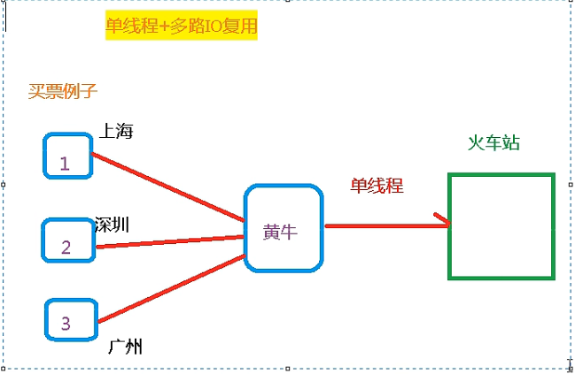

**redis与memcache的三点不同：支持多数据类型，支持持久化，单线程+多路IO复用，**

**并且：**

**memcache：多线程+锁**

**redis：单线程+多路IO复用  来实现多线程的效果，并且其效率比多线程高**


> 默认16个数据库，类似数组下标从0开始，初始默认使用0号库
>
> 使用命令 select  <dbid>来切换数据库。如: select 8 
>
> 统一密码管理，所有库同样密码。
>
> dbsize 查看当前数据库的key的数量
>
> flushdb 清空当前库
>
> flushall 通杀全部库

# 安装和启动

> 安装 ***C*** 语言的编译环境
>
> ```base
> yum install centos-release-scl scl-utils-build
> yum install -y devtoolset-8-toolchain
> scl enable devtoolset-8 bash
> ```
>
> 通过 ***wget*** 下载
>
> ```
> wget https://download.redis.io/releases/redis-6.2.6.tar.gz
> 
> // 下载路径：/opt
> ```
>
> 解压至当前目录
>
> ```
> tar -zxvf redis-6.2.6.tar.gz 
> ```
>
> 解压完成后进入目录
>
> ```
> cd redis-6.2.6
> ```
>
> 在当前目录下执行 ***make***
>
> ```
> make &&  make install
> ```
>
> 默认安装在 `/usr/local/bin`
>
> 
>
> ```
> redis-benchmark：性能测试工具，可以在自己本子运行，看看自己本子性能如何
> redis-check-aof：修复有问题的AOF文件，rdb和aof后面讲
> redis-check-dump：修复有问题的dump.rdb文件
> redis-sentinel：Redis集群使用
> redis-server：Redis服务器启动命令
> redis-cli：客户端，操作入口
> ```
>
> 
>
> 前台启动：***/usr/local/bin*** 目录下启动 ***redis***
>
> ```bash
> redis-server(前台启动)
> ```
>
> 
>
> 后台启动：
>
> - 安装 ***redis*** 的目录 ***/opt/redis-6.2.6*** 中将 ***redis.conf*** 复制到任意一个文件夹下
>
>   ```
>   cp redis.conf /etc/redis.conf
>   // 将redis.conf复制到/etc/下
>   ```
>
> - 修改 ***/etc/redis.conf*** 配置文件
>
>   ```bash
>   vim redis.conf
>   
>   # daemonize no 修改为 daemonize yes
>   # 把默认不支持后台启动改为支持后台启动
>   ```
>
>   
>
> - ***/usr/local/bin*** 目录下启动 ***redis***
>
>   ```bash
>   redis-server /etc/redis.conf
>   ```
>
> 
>
> 关闭 ***redis***
>
> - ***kill*** 进程
> - 命令 ***shutdown***


<u>**默认端口号：6379**</u>


# NoSQL数据库相关知识

- 解决 ***CPU*** 及内存压力

  

- 解决 ***IO*** 压力

  


***NoSQL（ NoSQL = Not Only SQL ）***，意即不仅仅是 ***SQL***，**泛指非关系型的数据库**。 

***NoSQL*** 不依赖业务逻辑方式存储，而以简单的 ***key-value*** 模式存储。因此大大的增加了数据库的扩展能力。

- 不遵循 ***SQL*** 标准。
- 不支持 ***ACID***。但不指不支持事务
- 远超于 ***SQL*** 的性能。


**适用于的场景**

- 对数据高并发的读写；
- 海量数据的读写； 
- 对数据高可扩展性的。

**不适用的场景**

- 需要事务支持；
- 基于 ***sql*** 的结构化查询存储，处理复杂的关系，需要即席查询。
- 用不着sql和用了sql也不行的情况，可以考虑nosql


常见的 ***NoSQL*** 数据库

- Redis
- MongoDB


大数据时代常用的数据库类型

- 行式数据库

  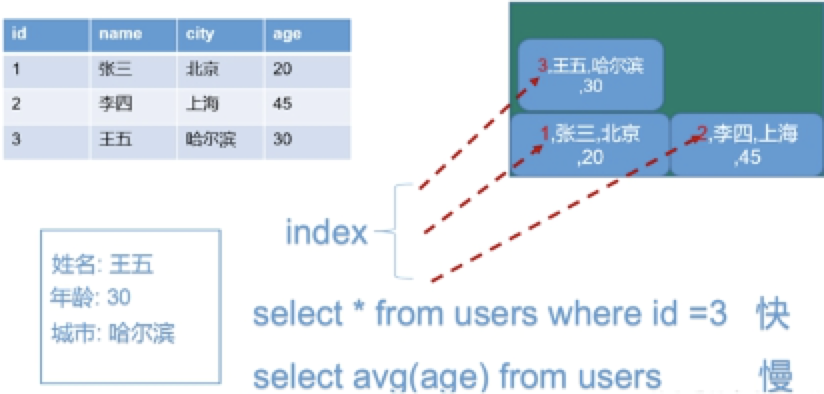

- 列式数据库

  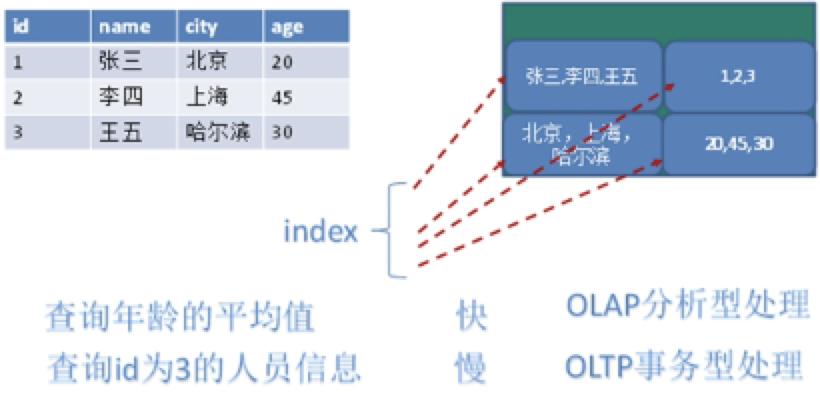


# 关于配置文件的解释

***redis.conf***


## ***Units*** 

> 单位，配置大小单位，开头定义了一些基本的度量单位，只支持 ***bytes***，不支持 ***bit***。
>
> 大小写不敏感。


## ***INCLUDES***

> 包含，多实例的情况可以把公用的配置文件提取出来。


## ***NETWORK***

> 网络相关配置。
>
> 
>
> ***bind***
>
> 默认情况 `bind=127.0.0.1` 只能接受本机的访问请求。
>
> 不写的情况下，无限制接受任何 ***ip*** 地址的访问。
>
> 生产环境肯定要写你应用服务器的地址，服务器是需要远程访问的，*<u>所以需要将其注释掉</u>*。
>
> 如果开启了***protected-mode***，那么在没有设定 ***bind ip*** 且没有设密码的情况下，***Redis*** 只允许接受本机的响应。远程访问需要改成 Protected-mode no
>
> 
>
> 
>
> ***protected-mode***
>
> 将本机访问保护模式设置 ***no***。
>
> 
>
> 
>
> ***port***
>
> 端口号，默认 ***6379***。
>
> 
>
> 
>
> ***tcp-backlog***
>
> 设置 ***tcp*** 的 ***backlog***，***backlog*** 其实是一个连接队列，***backlog*** 队列总和 $=$ 未完成三次握手队列 $+$ 已经完成三次握手队列。
>
> 在高并发环境下你需要一个高 ***backlog*** 值来避免慢客户端连接问题。
>
> 
>
> 
>
> ***timeout***
>
> 一个空闲的客户端维持多少秒会关闭，0 表示关闭该功能。即永不关闭。
>
> 
>
> 
>
> ***tcp-keepalive***
>
> 对访问客户端的一种心跳检测，每个 ***n*** 秒检测一次。
>
> 单位为秒，如果设置为 0，则不会进行 ***Keepalive*** 检测，建议设置成 60。
>
>  


## ***GENERAL***

> 通用。
>
> 
>
> ***daemonize***
>
> 是否为后台进程，设置为 ***yes***。
>
> 守护进程，后台启动。
>
> 
>
> 
>
> ***pidfile***
>
> pid:Process Identifier,进程识别号
>
> 存放 ***pid*** 文件的位置，每个实例会产生一个不同的 ***pid*** 文件。
>
> 
>
> 
>
> ***loglevel***
>
> 指定日志记录级别，***Redis*** 总共支持四个级别：***debug、verbose、notice、warning***，默认为 ***notice***。
>
> 
>
> 
>
> ***logfile***
>
> 日志文件名称。
>
> 
>
> 
>
> ***database***
>
> 设定库的数量 默认16，默认数据库为 0，可以使用 `SELECT <dbid>` 命令在连接上指定数据库 ***id***。
>
> 


## ***SECURITY***

> 安全。
>
> 访问密码的查看、设置和取消。
>
> 在命令中设置密码，只是临时的。重启 ***redis*** 服务器，密码就还原了。
>
> 永久设置，需要在配置文件中进行设置。


## ***LIMITS***

备注：新版设置客户端数在CLIENTS里，设置内存在MEMORY MANAGEMENT里

> 限制。
>
> 
>
> ***maxclients***
>
> 设置 ***redis*** 同时可以与多少个客户端进行连接。
>
>  默认情况下为 ***10000*** 个客户端。
>
> 如果达到了此限制，***redis*** 则会拒绝新的连接请求，并且向这些连接请求方发出 ***max number of clients reached*** 以作回应。
>
> 
>
> ***maxmemory***
>
> 建议**必须设置**，否则，将内存占满，造成服务器宕机。
>
> 设置 ***redis*** 可以使用的内存量。一旦到达内存使用上限，***redis*** 将会试图移除内部数据，移除规则可以通过 ***maxmemory-policy*** 来指定。
>
> 如果 ***redis*** 无法根据移除规则来移除内存中的数据，或者设置了不允许移除，那么 ***redis*** 则会针对那些需要申请内存的指令返回错误信息，比如 ***SET、LPUSH*** 等。
>
> 但是对于无内存申请的指令，仍然会正常响应，比如 ***GET*** 等。如果你的 ***redis*** 是主 ***redis***（ 说明你的 ***redis*** 有从 ***redis*** ），那么在设置内存使用上限时，需要在系统中留出一些内存空间给同步队列缓存，只有在你设置的是“不移除”的情况下，才不用考虑这个因素。
>
> 
>
> 
>
> ***maxmemory-policy***
>
> ***volatile-lru***：使用 ***LRU*** 算法移除 ***key***，只对设置了过期时间的键（最近最少使用）。
>
> ***allkeys-lru***：在所有集合 ***key*** 中，使用 ***LRU*** 算法移除 ***key***。
>
> ***volatile-random***：在过期集合中移除随机的 ***key***，只对设置了过期时间的键。
>
> ***allkeys-random***：在所有集合 ***key*** 中，移除随机的 ***key***。
>
> ***volatile-ttl***：移除那些 ***TTL*** 值最小的 ***key***，即那些最近要过期的 ***key***。
>
> ***noeviction***：不进行移除。针对写操作，只是返回错误信息。
>
> 
>
> 
>
> ***maxmemory-samples***
>
> 设置样本数量，***LRU*** 算法和最小 ***TTL*** 算法都并非是精确的算法，而是估算值，所以你可以设置样本的大小，***redis*** 默认会检查这么多个 ***key*** 并选择其中 ***LRU*** 的那个。
>
> 一般设置 3 到 7 的数字，数值越小样本越不准确，但性能消耗越小。
>
> 


# 常用五大Value基本数据类型

## 前备知识

### key操作

> `keys *`：查看当前库所有 ***key***  
>
> `exists key`：判断某个 ***key*** 是否存在
>
> `type key`：查看你的 ***key*** 是什么类型
>
> `del key` ：删除指定的 ***key*** 数据
>
> `unlink key`：根据 ***value*** 选择非阻塞删除，仅将 ***keys*** 从 ***keyspace*** 元数据中删除，真正的删除会在后续**异步操作**
>
> `expire key 10` ：为给定的 ***key*** 设置过期时间
>
> `ttl key`：查看还有多少秒过期，-1表示永不过期，-2表示已过期

### 数据库操作

> `select`：命令切换数据库
>
> `dbsize`：查看当前数据库的 ***key*** 的数量
>
> `flushdb`：清空当前库
>
> `flushall`：通杀全部库

### 注意事项

1. 同类型+同key名可以覆盖，不同类型+同key名会报错

## 字符串（String）

***String*** 类型是二进制安全的。意味着 ***Redis*** 的 ***string*** 可以包含任何数据。比如 ***jpg*** 图片或者序列化的对象。

***String*** 类型是 ***Redis*** 最基本的数据类型，一个 ***Redis*** 中字符串类型的 ***value*** 最多可以是 512M。


> `set <key> <value>`：添加键值对，设置相同的key会覆盖之前的value
>
> `get <key>`：查询对应键值
>
> `append <key> <value>`：将给定的 ***\<value>*** 追加到原值的末尾
>
> `strlen <key>`：获得值的长度
>
> `setnx <key> <value>`：（Set No Exist）只有在 ***key*** 不存在时，设置 ***key*** 的值
>
> `incr <key>`：将 ***key*** 中储存的数字值增 1，只能对数字值操作，如果为空，新增值为 1（**<u>具有原子性</u>**）
>
> `decr <key>`：将 ***key*** 中储存的数字值减 1，只能对数字值操作，如果为空，新增值为 -1
>
> `incrby/decrby <key><步长>`：将 ***key*** 中储存的数字值增减。自定义步长
>
> `mset <key1> <value1> <key2> <value2>` ：同时设置一个或多个 ***key-value*** 对 
>
> `mget <key1> <key2> <key3>...`：同时获取一个或多个 ***value*** 
>
> `msetnx <key1> <value1> <key2> <value2>... `：同时设置一个或多个 ***key-value*** 对，当且仅当所有给定 ***key*** 都不存在	
>
> `getrange <key> <起始位置> <结束位置>`：获得value指定下标范围内的值
>
> `setrange <key> <起始位置> <value>`：用 ***\<value>*** 覆写 ***\<key>*** 所储存的字符串值
>
> `setex <key> <过期时间> <value>`：设置键值的同时，设置过期时间，单位秒。
>
> `getset <key> <value>`：以新换旧，设置了新值同时获得旧值。


**原子性**(并非事务中的原子性，而是redis特有的原子性)

所谓 **原子** 操作是指不会被线程调度机制打断的操作；

这种操作一旦开始，就一直运行到结束，中间不会有任何 ***context switch*** （切换到另一个线程）。

- **在单线程中， 能够在单条指令中完成的操作都可以认为是"原子操作"，因为中断只能发生于指令之间。**

- 在多线程中（例如java中多线程对i进行i++【i=i+1】），不能被其它进程（线程）打断的操作就叫原子操作。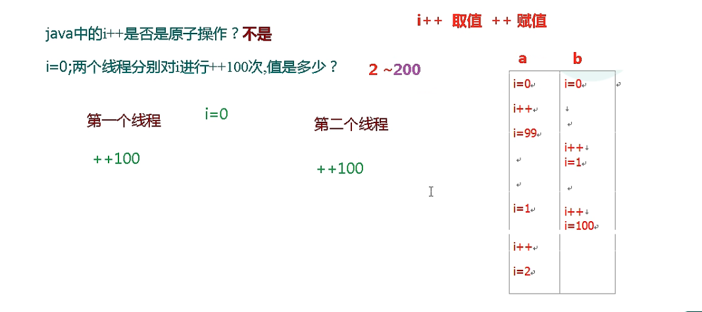

***Redis*** 单命令的原子性主要得益于 ***Redis*** 的单线程。


**String的数据结构**

内部结构实现上类似于 ***Java*** 的 ***ArrayList***，采用预分配冗余空间的方式来减少内存的频繁分配.


如图中所示，内部为当前字符串实际分配的空间capacity一般要高于实际字符串长度len。当字符

串长度小于1M时，扩容都是加倍现有的空间，如果超过1M，扩容时一次只会多扩1M的空间。需要注

意的是字符串最大长度为512M。


## 列表（List）

***Redis*** 列表是简单的字符串列表，按照插入顺序排序。你可以添加一个元素到列表的头部（左边）或者尾部（右边）。

它的底层实际是个双向链表，对两端的操作性能很高，通过索引下标的操作中间的节点性能会较差。


> `lpush/rpush <key><value1><value2><value3> ....`： 从左边/右边插入一个或多个值。
>
> ```
> lpush k1 v1 v2 v3
> lrange k1 0 -1
> 输出：v3 v2 v1
> 
> rpush k1 v1 v2 v3
> rrange k1 0 -1  （0，-1）表示取所有的值
> 输出：v1 v2 v3
> ```
>
> `lpop/rpop <key>`：从左边/右边吐出一个值。值在键在，值光键亡。
>
> `rpoplpush <key1><key2>`：从 ***\<key1>*** 列表右边吐出一个值，插到 ***\<key2>*** 列表左边。
>
> `lrange <key><start><stop>`：按照索引下标获得元素（从左到右）
>
> `lrange mylist 0 -1  0`：左边第一个，-1右边第一个，（0 -1表示获取所有）
>
> `lindex <key><index>`：按照索引下标获得元素（从左到右）
>
> `llen <key>`：获得列表长度  
>
> `linsert <key> before/after <value> <newvalue>`：在 ***\<value>*** 的前面/后面插入 ***\<newvalue>*** 插入值
>
> `lrem <key><n><value>`：从左边删除 ***n*** 个 ***value***（从左到右）
>
> `lset<key><index><value>`：将列表 ***key*** 下标为 ***index*** 的值替换成 ***value***


**数据结构**

***List*** 的数据结构为快速链表 ***quickList***。

首先在列表元素较少的情况下会使用一块连续的内存存储，这个结构是 ***ziplist***，也即是压缩列表。

它将所有的元素紧挨着一起存储，分配的是一块连续的内存。

当数据量比较多的时候才会改成 ***quicklist***。

因为普通的链表需要的附加指针空间太大，会比较浪费空间。比如这个列表里存的只是 ***int*** 类型的数据，结构上还需要两个额外的指针 ***prev*** 和 ***next***。

***Redis*** 将链表和 ***ziplist*** 结合起来组成了 ***quicklist***。也就是将多个 ***ziplist*** 使用双向指针串起来使用。这样既满足了快速的插入删除性能，又不会出现太大的空间冗余。


## Set（集合）

***Set*** 对外提供的功能与 ***List*** 类似列表的功能，特殊之处在于 ***Set*** 是可以 **<u>自动排重</u>** 的，当需要存储一个列表数据，又不希望出现重复数据时，***Set*** 是一个很好的选择，并且 ***Set*** 提供了判断某个成员是否在一个 ***Set*** 集合内的重要接口，这个也是 ***List*** 所不能提供的。

***Redis*** 的 ***Set*** 是 ***String*** 类型的无序集合。它底层其实是一个 ***value*** 为 ***null*** 的 ***hash*** 表，所以添加，删除，查找的复杂度都是 ***O(1)***。

一个算法，随着数据的增加，执行时间的长短，如果是 ***O(1)***，数据增加，查找数据的时间不变。


> `sadd <key><value1><value2> ..... `：将一个或多个 ***member*** 元素加入到集合 ***key*** 中，已经存在的 ***member*** 元素将被忽略
>
> `smembers <key>`：取出该集合的所有值。
>
> `sismember <key><value>`：判断集合 ***\<key>*** 是否为含有该 ***\<value>*** 值，有返回 1，没有返回 0
>
> `scard<key>`：返回该集合的元素个数。
>
> `srem <key><value1><value2> ....`：删除集合中的某个元素
>
> `spop <key>`：随机从该集合中吐出一个值
>
> `srandmember <key><n>`：随机从该集合中取出 ***n*** 个值，不会从集合中删除 
>
> `smove <source><destination>value`：把集合中一个值从一个集合移动到另一个集合
>
> `sinter <key1><key2>`：返回两个集合的交集元素
>
> `sunion <key1><key2>`：返回两个集合的并集元素
>
> `sdiff <key1><key2>`：返回两个集合的差集元素（***key1*** 中的，不包含 ***key2*** 中的）


**数据结构**

***Set*** 数据结构是字典，字典是用哈希表实现的。


## Hash（哈希）

***Redis hash*** 是一个键值对集合。

***Redis hash*** 是一个 ***String*** 类型的 ***field*** 和 ***value*** 的映射表，***hash*** 特别**适合用于存储对象**。


> `hset <key><field><value>`：给 ***\<key>*** 集合中的 ***\<field>*** 键赋值 ***\<value>***
>
> `hget <key1><field>`：从 ***\<key1>*** 集合 ***\<field>*** 取出 ***value*** 
>
> `hmset <key1><field1><value1><field2><value2>...`： 批量设置 ***hash*** 的值
>
> `hexists <key1><field>`：查看哈希表 ***key*** 中，给定域 ***field*** 是否存在
>
> `hkeys <key>`：列出该 ***hash*** 集合的所有 ***field***
>
> `hvals <key>`：列出该 ***hash*** 集合的所有 ***value***
>
> `hincrby <key><field><increment>`：为哈希表 ***key*** 中的域 ***field*** 的值加上增量 n
>
> `hsetnx <key><field><value>`：将哈希表 ***key*** 中的域 ***field*** 的值设置为 ***value*** ，当且仅当域 ***field*** 不存在


**数据结构**

***Hash*** 类型对应的数据结构是两种：***ziplist***（压缩列表），***hashtable***（哈希表）。

当 ***field-value*** 长度较短且个数较少时，使用 ***ziplist***，否则使用 ***hashtable***。


## Zset（有序集合）

***Redis*** 有序集合 ***zset*** 与普通集合 ***set*** 非常相似，是一个没有重复元素的字符串集合。

不同之处是有序集合的每个成员都关联了一个评分（***score***）,这个评分（***score***）被用来按照从最低分到最高分的方式排序集合中的成员。集合的成员是唯一的，但是评分可以是重复的。

因为元素是有序的，所以可以很快的根据评分（***score***）或者次序（***position***）来获取一个范围的元素。

访问有序集合的中间元素也是非常快的，因此能够使用有序集合作为一个没有重复成员的智能列表。

> `zadd <key><score1><value1><score2><value2>…`：将一个或多个 ***member*** 元素及其 ***score*** 值加入到有序集 ***key*** 当中
>
> `zrange <key><start><stop> [WITHSCORES]  `：返回有序集 ***key*** 中，下标在 ***\<start>\<stop>*** 之间的元素，当带 ***WITHSCORES***，可以让分数一起和值返回到结果集
>
> `zrangebyscore key min max [withscores] [limit offset count]`：返回有序集 ***key*** 中，所有 ***score*** 值介于 ***min*** 和 ***max*** 之间（包括等于 ***min*** 或 ***max*** ）的成员。有序集成员按 ***score*** 值递增（从小到大）次序排列。
>
> `zrevrangebyscore key max min [withscores] [limit offset count] `：同上，改为从大到小排列
>
> `zincrby <key><increment><value>`：为元素的 ***score*** 加上增量
>
> `zrem <key><value>`：删除该集合下，指定值的元素
>
> `zcount <key><min><max>`：统计该集合，分数区间内的元素个数 
>
> `zrank <key><value>`：返回该值在集合中的排名，从 0 开始。


**数据结构**

***SortedSet（zset）***是 ***Redis*** 提供的一个非常特别的数据结构，一方面它等价于 ***Java*** 的数据结构 ***Map<String, Double>***，可以给每一个元素 ***value*** 赋予一个权重 ***score***，另一方面它又类似于 ***TreeSet***，内部的元素会按照权重 ***score*** 进行排序，可以得到每个元素的名次，还可以通过 ***score*** 的范围来获取元素的列表。

***zset*** 底层使用了两个数据结构

- ***hash***，***hash*** 的作用就是关联元素 ***value*** 和权重 ***score***，保障元素 ***value*** 的唯一性，可以通过元素 ***value*** 找到相应的 ***score*** 值

- 跳跃表，跳跃表的目的在于给元素 ***value*** 排序，根据 ***score*** 的范围获取元素列表


# Redis6新数据结构

## Bitmaps

### 简介

Redis提供了Bitmaps这个“数据类型”可以实现对位的操作：

（1）  Bitmaps**本身不是一种数据类型**， 实际上它就是**字符串**（key-value） ， 但是它可以**对字符串的位进行操作**。

（2）  Bitmaps单独提供了一套命令， 所以在Redis中使用Bitmaps和使用字符串的方法不太相同。 可以把Bitmaps想象成一个以位为单位的数组， **数组的每个单元只能存储0和1**， 数组的下标在Bitmaps中叫做偏移量。

### 命令

#### setbit

> `setbit<key><offset><value>`设置Bitmaps中某个偏移量的值（0或1），offset:偏移量从0开始  
>
> 实例：每个独立用户是否访问过网站存放在Bitmaps中， 将访问的用户记做1， 没有访问的用户记做0， 用偏移量作为用户的id。
>
> 设置键的第offset个位的值（从0算起） ， 假设现在有20个用户，userid=1， 6， 11， 15， 19的用户对网站进行了访问， 那么当前Bitmaps初始化结果如图
>
> 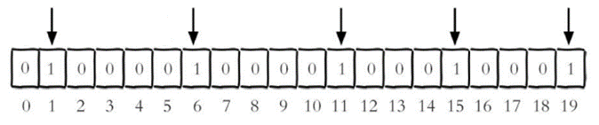
>
> 注：
>
> 很多应用的用户id以一个指定数字（例如10000） 开头， 直接将用户id和Bitmaps的偏移量对应势必会造成一定的浪费， 通常的做法是每次做setbit操作时将用户id减去这个指定数字。
>
> 在第一次初始化Bitmaps时， 假如偏移量非常大， 那么整个初始化过程执行会比较慢， 可能会造成Redis的阻塞。

#### getbit

> `getbit<key><offset>`获取Bitmaps中某个偏移量的值，只能是0或1

#### bitcount

统计**字符串**(即8位 0或1)中被设置为1的bit数。一般情况下，给定的整个字符串都会被进行计数，通过指定额外的start 或 end 参数，可以让计数只在特定的位上进行。start 和 end 参数的设置，都可以使用负数值：比如 -1 表示最后一个位，而 -2 表示倒数第二个位，start、end 是指**bit组即8个bit**即**一个字节(bytes)**的下标数，并非bit偏移量二者皆包含。

> `bitcount<key>[start end]` 统计字符串从start字节到end字节比特值为1的bit数量
>
> 
>
> 举例： K1 【01000001 01000000 00000000 00100001】，对应【0，1，2，3】
>
> bitcount K1 1 2 ： 统计下标1、2字节组中bit=1的个数，即01000000 00000000
>
> --》bitcount K1 1 2 　　--》1
>
>  
>
> bitcount K1 1 3 ： 统计下标1、2字节组中bit=1的个数，即01000000 00000000 00100001
>
> --》bitcount K1 1 3　　--》3
>
> 
>
> 注意：redis的setbit设置或清除的是bit位置，而bitcount计算的是byte位置。

#### bitop

bitop是一个复合操作， 它可以做多个Bitmaps的**and（交集） 、 or（并集） 、 not（非） 、 xor（异或）** 操作并将结果保存在**destkey**中

>bitop and(or/not/xor) <destkey> [key1、key2…]
>
>实例:
>
>2020-11-04 日访问网站的userid=1,2,5,9。
>
>2020-11-03 日访问网站的userid=0,1,4,9。
>
>计算出两天都访问过网站的用户数量:bitop and(交集) unique:users:and:20201104_03(destkey)
>
> unique:users:20201103(key1) unique:users:20201104(key2)

### Bitmaps与set对比

假设网站有1亿用户， 每天独立访问的用户有5千万， 如果每天用集合类型和Bitmaps分别存储活跃用户可以得到表

| set和Bitmaps存储一天活跃用户对比 |                    |                  |                        |
| -------------------------------- | ------------------ | ---------------- | ---------------------- |
| 数据类型                         | 每个用户id占用空间 | 需要存储的用户量 | 全部内存量             |
| 集合类型                         | 64位               | 50000000         | 64位*50000000 = 400MB  |
| Bitmaps                          | 1位                | 100000000        | 1位*100000000 = 12.5MB |

很明显， 这种情况下使用Bitmaps能节省很多的内存空间， 尤其是随着时间推移节省的内存还是非常可观的

| set和Bitmaps存储独立用户空间对比 |        |        |       |
| -------------------------------- | ------ | ------ | ----- |
| 数据类型                         | 一天   | 一个月 | 一年  |
| 集合类型                         | 400MB  | 12GB   | 144GB |
| Bitmaps                          | 12.5MB | 375MB  | 4.5GB |

但Bitmaps并不是万金油， 假如该网站每天的独立访问用户很少， 例如只有10万（大量的僵尸用户） ， 那么两者的对比如下表所示， 很显然， 这时候使用Bitmaps就不太合适了， 因为基本上大部分位都是0。

| set和Bitmaps存储一天活跃用户对比（独立用户比较少） |                    |                  |                        |
| -------------------------------------------------- | ------------------ | ---------------- | ---------------------- |
| 数据类型                                           | 每个userid占用空间 | 需要存储的用户量 | 全部内存量             |
| 集合类型                                           | 64位               | 100000           | 64位*100000 = 800KB    |
| Bitmaps                                            | 1位                | 100000000        | 1位*100000000 = 12.5MB |

## HyperLogLog

### 介绍

前备知识：什么是基数?

比如数据集 {1, 3, 5, 7, 5, 7, 8}， 那么这个数据集的基数集为 {1, 3, 5 ,7, 8}, 基数(不重复元素)为5。 基数估计就是在误差可接受的范围内，快速计算基数。


在工作当中，我们经常会遇到与统计相关的功能需求，比如统计网站PV（PageView页面访问量）,可以使用Redis的incr、incrby轻松实现。

但像UV（UniqueVisitor，独立访客）、独立IP数、搜索记录数等需要去重和计数的问题如何解决？这种求集合中**不重复元素个数**的问题称为**基数问题**。

解决基数问题有很多种方案：

（1）数据存储在MySQL表中，使用distinct count计算不重复个数

（2）使用Redis提供的hash、set、bitmaps等数据结构来处理

**以上的方案结果精确，但随着数据不断增加，导致占用空间越来越大，对于非常大的数据集是不切实际的。**

能否能够降低一定的精度来平衡存储空间？**Redis推出了HyperLogLog**

Redis HyperLogLog 是用来做基数统计的算法，HyperLogLog 的优点是，在输入元素的数量或者体积非常非常大时，计算基数所需的空间总是固定的、并且是很小的。

在 Redis 里面，每个 HyperLogLog 键只需要花费 12 KB 内存，就可以计算接近 2^64 个不同元素的基数。这和计算基数时，元素越多耗费内存就越多的集合形成鲜明对比。

但是，因为 HyperLogLog 只会根据输入元素来计算基数，而不会储存输入元素本身，所以 HyperLogLog 不能像集合那样，返回输入的各个元素。

**他这个和set区别是他不存元素，专门用于计算基数的，而且是通过数学概率统计的，有一定的误差但误差在允许范围类，因为不存储所以不怎么耗费内存，但是因为不存元素，你加了什么也取不出来**

### 命令

#### pfadd 

> `pfadd <key>< element> [element ...]`  添加指定元素到 HyperLogLog 中
>
> 实例：将所有元素添加到指定HyperLogLog数据结构中。如果执行命令后HLL估计的近似基数发生变化，则返回1，否则返回0。
>
> 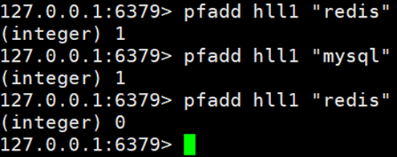

#### pfcount

> `pfcount<key> [key ...]` 计算HLL的近似基数，可以计算多个HLL，比如用HLL存储每天的UV，计算一周的UV可以使用7天的UV合并计算即可
>
> 实例：
>
> 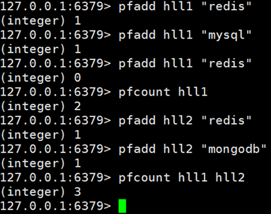

#### pfmerge

> pfmerge<destkey><sourcekey> [sourcekey ...] 将一个或多个HLL合并后的结果存储在另一个HLL中，比如每月活跃用户可以使用每天的活跃用户来合并计算可得
>
>   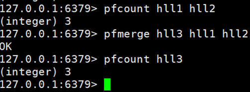     

##  Geospatial

### 简介

Redis 3.2 中增加了对GEO类型的支持。GEO，Geographic，地理信息的缩写。该类型，就是元素的2维坐标，在地图上就是经纬度。redis基于该类型，提供了经纬度设置，查询，范围查询，距离查询，经纬度Hash等常见操作。

### 命令

#### geoadd

>`geoadd<key>< longitude><latitude><member> [longitude latitude member...]`  添加地理位置（经度，纬度，名称）
>
>实例:
>
>`geoadd china:city 121.47 31.23 shanghai`
>
>`geoadd china:city 106.50 29.53 chongqing 114.05 22.52 shenzhen 116.38 39.90 beijing`

**两极无法直接添加，一般会下载城市数据，直接通过 Java 程序一次性导入。**

**有效的经度从 -180 度到 180 度。有效的纬度从 -85.05112878 度到 85.05112878 度。**

**当坐标位置超出指定范围时，该命令将会返回一个错误。**

**已经添加的数据，是无法再次往里面添加的。**

#### geopos

> `geopos <key><member> [member...]` 获得指定地区的坐标值
>
> 实例：
>
> 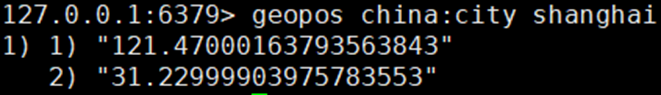

#### geodist

> `geodist<key><member1><member2> [m|km|ft|mi ]` 获取两个位置之间的直线距离
>
> 实例:
>
> 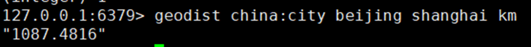
>
> 
>
> 单位：
> m 表示单位为米[默认值]。
> km 表示单位为千米。
> mi 表示单位为英里。
> ft 表示单位为英尺。
>
> 如果用户没有显式地指定单位参数， 那么 GEODIST 默认使用米作为单位

#### georadius

> `georadius<key>< longitude><latitude>radius [m|km|ft|mi]`  以给定的经纬度为中心，找出某一半径内的元素  （经度 纬度 距离 单位）
>
> 实例：
>
> 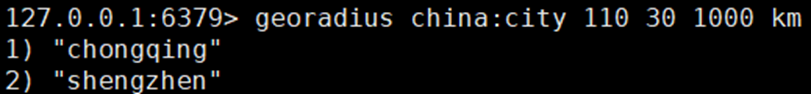


# Redis的发布与订阅

***Redis*** 发布订阅（ ***pub/sub*** ）是一种消息通信模式：发送者（ ***pub*** ）发送消息，订阅者（ ***sub*** ）接收消息。

***Redis*** 客户端可以订阅任意数量的频道。


1. 客户端可以订阅频道


2. 当给这个频道发布消息后，消息就会发送给订阅的客户端


> ```
> subscribe channel # 订阅频道
> 
> publish channel hello # 频道发送信息
> ```

# 事务和锁机制

**Redis 事务是一个单独的隔离操作：事务中的所有命令都会序列化、按顺序地执行。事务在执行的过程中，不会被其他客户端发送来的命令请求所打断。**

**Redis 事务的主要作用就是串联多个命令防止别的命令插队。**

## *命令：Multi*、*Exec*、*Discard*

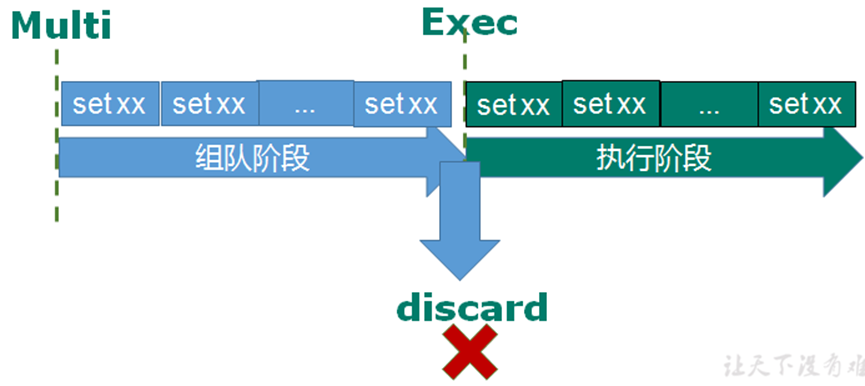

*从输入Multi命令开始，输入的命令都会依次进入命令队列中，但不会执行，直到输入Exec后，Redis会将之前的命令队列中的命令依次执行。*

**组队的过程中可以通过discard来放弃组队。**

**一旦执行，无法撤销，执行中某个命令出现了错误，这个指令将无法执行，但是这个命令前后的命令都正常执行生效** 


> ***Multi***
>
> ***Exec***
>
> ***Discard***	
>
> 从输入 ***Multi*** 命令开始，输入的命令都会依次进入命令队列中，但不会执行，直到输入 ***Exec*** 后，***Redis*** 会将之前的命令队列中的命令依次执行。
>
> 组队的过程中可以通过 ***Discard*** 来放弃组队。 


- 组队成功，提交成功

  

- 放弃组队

  

- 组队中有命令错误，不会执行

  

- 组队中不报错，执行时报错

  


当组队中某个命令出现了报告错误，执行时整个的所有队列都会被取消。

当执行中某个命令出现了错误，这个指令将无法执行，但是这个命令前后的命令都正常执行生效


## 悲观锁

例子

一个请求想给金额减8000

一个请求想给金额减5000

一个请求想给金额减1000

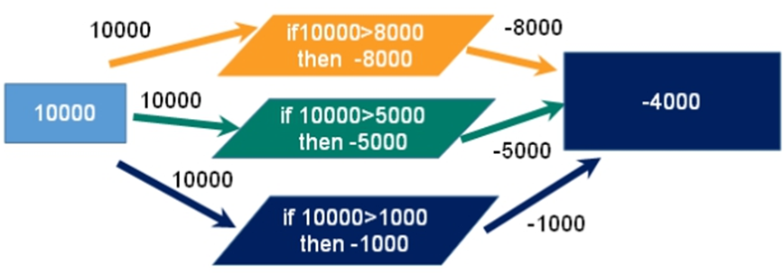


悲观锁（***Pessimistic Lock***），即每次去拿数据的时候都认为有其他线程会修改，所以每次在拿数据的时候都会上锁，这样其他线程想要拿到这个数据就会被 ***block*** 直到成功拿到锁。（效率低）

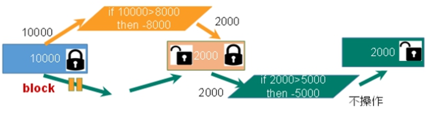


## 乐观锁

乐观锁（***Optimistic Lock***），即每次去拿数据的时候都认为其他线程不会修改，所以不会上锁，但是在更新的时候会判断一下在此期间有没有其他线程去更新这个数据，可以使用版本号等机制。

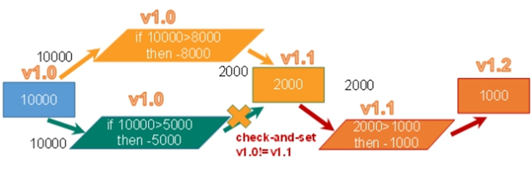

**乐观锁适用于多读的应用类型，这样可以提高吞吐量**。

***Redis*** 就是利用这种 ***check-and-set（CAS）*** 机制实现事务的。

例子：

抢票过程中也是这个样子，实际情况下，抢票可以有多个人抢到票，但是付款只能有一个人。

当使用悲观锁时候，在抢票时判断，所以只能有一个人抢到票，所以只能一个人付款

当使用乐观锁时候，在抢票时不进行判断，可以有多个人抢到票，但是每个人付款的时候要进行数据版本判断，第一个人付款之后，版本更改，其他人便无法付款。

## *乐观锁的使用：Watch、unwatch*

watch：

在执行 ***multi*** 之前，先执行 ***watch key1 [key2]***，可以监视一个（或多个 ）***key*** 。如果在事务执行之前这个 ***key*** 被其他命令所改动，那么事务将被打断，执行事务报nil错误。

nuwatch:

取消 ***WATCH*** 命令对所有 ***key*** 的监视。

但如果在执行 ***WATCH*** 命令之后，***EXEC*** 命令或 ***DISCARD*** 命令先被执行，那么就不需要再执行 ***UNWATCH*** 。


## Redis事务三特性

- 单独的隔离操作 

  事务中的所有命令都会序列化、按顺序地执行。事务在执行的过程中，不会被其他客户端发送来的命令请求所打断。 

- 没有隔离级别的概念 

  队列中的命令没有提交之前都不会实际被执行，因为事务提交前任何指令都不会被实际执行。

- 不保证原子性 

  事务中如果有一条命令执行失败，其后的命令仍然会被执行，没有回滚 。


# 持久化

Redis 提供了2个不同形式的持久化方式。
**RDB（Redis DataBase）**
**AOF（Append Of File）**

## RDB

在指定的时间间隔内将内存中的数据集快照写入磁盘， 即 ***Snapshot*** 快照，恢复时是将快照文件直接读到内存里。


### 备份是如何执行的


相关解释：[RDB执行流程](https://blog.csdn.net/yidan7063/article/details/107722544)

***Redis*** 会单独创建一个子进程（***fork***）来进行持久化。

先将数据写入到一个临时文件中，待（上一次）持久化过程完成后，再将这个临时文件内容覆盖到 ***dump.rdb***。 

整个过程中，主进程是不进行任何 ***IO*** 操作的，这就确保了极高的性能。如果需要进行大规模数据的恢复，且对于数据恢复的完整性不是非常敏感，那 ***RDB*** 方式要比 ***AOF*** 方式更加的高效。

***RDB* 的缺点是最后一次持久化后的数据可能丢失**：在最后一次save时间间隔内服务器挂掉，数据还没有达到快照条件，使数据丢失

 

### Fork

- 作用是复制一个与当前进程一样的进程。新进程的所有数据（变量、环境变量、程序计数器等） 数值都和原进程一致，但是是一个全新的进程，并作为原进程的子进程

- 在 ***Linux*** 程序中，***fork()*** 会产生一个和父进程完全相同的子进程，但子进程在此后多会 ***exec*** 系统调用，出于效率考虑，***Linux*** 中引入了 **写时复制技术**【【**写时复制**（**Copy-on-write**，简称**COW**）是一种计算机[程序设计](https://zh.wikipedia.org/wiki/程式設計)领域的优化策略。其核心思想是，如果有多个调用者（callers）同时请求相同资源（如内存或磁盘上的[数据存储](https://cloud.tencent.com/product/cdcs?from=10680)），他们会共同获取相同的指针指向相同的资源，直到某个调用者试图修改资源的内容时，系统才会真正复制一份专用副本（private copy）给该调用者，而其他调用者所见到的最初的资源仍然保持不变。这过程对其他的调用者都是[透明](https://zh.wikipedia.org/wiki/透明)的。此作法主要的优点是如果调用者没有修改该资源，就不会有副本（private copy）被创建，因此多个调用者只是读取操作时可以共享同一份资源。】】

- **一般情况父进程和子进程会共用同一段物理内存**，当进程空间的各段的内容要发生变化时，会把父进程的内容复制一份给子进程


### 配置

> 以下配置所在位置redis.conf里的SNAPSHOTTING下
>
> ***dump* 文件名字**
>
> 快照的文件名称，默认为 ***dump.rdb***。
>
> 
>
> 
>
> ***dump* 保存位置**
>
> ***rdb*** 文件的保存路径可以修改。默认为 ***Redis*** 启动命令程序所在的目录下。
>
> 
>
> 
>
> ***stop-writes-on-bgsave-error***
>
> 即当 ***redis*** 无法写入磁盘，关闭 ***redis*** 的写入操作。
>
> 
>
> 
>
> ***rdbcompression**压缩文件*****
>
> 对于存储到磁盘中的快照，可以设置是否进行压缩存储。如果是的话，redis会采用LZF算法进行压缩。
>
> 如果你不想消耗CPU来进行压缩的话，可以设置为关闭此功能。推荐yes.
>
> 
>
> 
>
> ***rdbchecksum检查完整性***
>
> 在存储快照后，还可以让redis使用CRC64算法来进行数据校验，
>
> 但是这样做会增加大约10%的性能消耗，如果希望获取到最大的性能提升，可以关闭此功能
>
> 但推荐yes.
>
> 
>
> 
>
> ***save***
>
> 表示写操作的触发条件。
>
> ```
> 格式：save 秒 写操作次数
> ```
>
> RDB是整个内存的压缩过的Snapshot，RDB的数据结构，可以配置复合的快照触发条件，
>
> 默认是1分钟内改了1万次，或5分钟内改了10次，或15分钟内改了1次。这个设置默认被注释掉了
>
> 禁用：不设置save指令，或者给save传入空字符串
>
> 
>
> 

### 命令save VS bgsave

> save ：save时只管保存，其它不管，全部阻塞。手动保存。不建议。
> bgsave：Redis会在后台异步进行快照操作， 快照同时还可以响应客户端请求。
> 可以通过lastsave 命令获取最后一次成功执行快照的时间

### rdb的备份

**就是复制rdb文件，等到需要恢复的时候让redis自动加载这个副本**，可以用shell编程写个脚本，定时备份该文件

先通过config get dir  查询rdb文件的目录 
将*.rdb的文件拷贝到别的地方
rdb的恢复

- 关闭Redis
- 先把备份的文件拷贝到工作目录下 cp dump2.rdb dump.rdb
- 启动Redis, 备份数据会直接加载

### 如何停止RDB

动态停止RDB：`redis-cli config set save ""`

#save后给空值，表示禁用保存策略

### 优点

- 适合大规模的数据恢复；
- 对数据完整性和一致性要求不高更适合使用；
- 节省磁盘空间；
- 恢复速度快。


### 缺点

- ***Fork*** 的时候，内存中的数据被克隆了一份，大致 2 倍的膨胀性需要考虑；
- 虽然 ***Redis*** 在 ***fork*** 时使用了**写时拷贝技术**，但是如果数据庞大时还是比较消耗性能；
- 在备份周期在一定间隔时间做一次备份，所以如果 ***Redis*** 意外 ***down*** 掉的话，就会丢失最后一次快照后的所有修改。


## AOF

以**日志的形式来记录每个写操作（增量保存）**，将 ***Redis*** 执行过的所有写指令记录下来（**读操作不记录**）， <u>只许追加文件但不可以改写文件</u>，***Redis*** 启动之初会读取该文件重新构建数据，换言之，如果 ***Redis重启就会根据日志文件的内容将写指令从前到后执行一次以完成数据的恢复工作**。


**执行流程**

- 客户端的请求写命令会被 ***append*** 追加到 ***AOF*** 缓冲区内；

- ***AOF*** 缓冲区根据 ***AOF*** 持久化策略 `[always,everysec,no]` 将操作 ***sync*** 同步到磁盘的 ***AOF*** 文件中；

- ***AOF*** 文件大小超过重写策略或手动重写时，会对 ***AOF*** 文件 ***Rewrite*** 重写，压缩 ***AOF*** 文件容量；

- ***Redis*** 服务重启时，会重新 ***load*** 加载 ***AOF*** 文件中的写操作达到数据恢复的目的。


> ***AOF*** 和 ***RDB*** 同时开启时，系统默认加载 ***AOF*** 的数据，RDB中的数据不会被加载（数据不会存在丢失）

### 配置

> ***AOF* 默认不开启** 
>
> 
>
> 
>
> **文件名字**
>
> 
>
> 
>
> ***AOF* 同步频率设置**
>
> 
>
> ***appendfsync always***
>
> ​	始终同步，每次 ***Redis*** 的写入都会立刻记入日志；
>
> ​	性能较差但数据完整性比较好。
>
> ***appendfsync everysec***
>
> ​	每秒同步，每秒记入日志一次，如果宕机，本秒的数据可能丢失。
>
> ***appendfsync no***
>
> ​	***Redis*** 不主动进行同步，把同步时机交给操作系统。
>
> 
>
>  ***Rewrite* 压缩**
>
> 当 ***AOF*** 文件的大小超过所设定的阈值时，***Redis*** 就会启动 ***AOF*** 文件的内容压缩，只保留可以恢复数据的最小指令集。可以使用命令 ***bgrewriteaof***。
>
> 

### 备份方法和RDB一样

### AOF恢复

正常恢复

- 修改默认的appendonly no，改为yes
- 将有数据的aof文件复制一份保存到对应目录(查看目录：config get dir)
- 恢复：重启redis然后重新加载

异常恢复

- 修改默认的appendonly no，改为yes
- 如遇到**AOF**文件损坏**，通过/usr/local/bin/**redis-check-aof--fix appendonly.aof进行恢复
- 备份被写坏的AOF文件
- 恢复：重启redis，然后重新加载

### AOF同步频率设置

`appendfsync always`

始终同步，每次Redis的写入都会立刻记入日志；性能较差但数据完整性比较好

`appendfsync everysec`

每秒同步，每秒记入日志一次，如果宕机，本秒的数据可能丢失。

`appendfsync no`

redis不主动进行同步，把同步时机交给操作系统。

### AOF重写/Rewrite

1. 是什么：

> AOF采用文件追加方式，文件会越来越大为避免出现此种情况，新增了重写机制, 当AOF文件的大小超过所设定的阈值时，Redis就会启动AOF文件的内容压缩， 只保留可以恢复数据的最小指令集.可以使用命令bgrewriteaof

2. 重写原理，如何实现重写

> AOF文件**持续增长而过大时，会fork出一条新进程来将文件重写**(也是先写临时文件最后再rename)，redis4.0版本后的重写，实际上就是**把rdb 的快照，以二级制的形式附在新的aof头部，作为已有的历史数据，替换掉原来的流水账操作。**
>
> 
>
> no-appendfsync-on-rewrite设置：
>
> 如果 no-appendfsync-on-rewrite=yes ,设置重写时暂停AOF持久化，不写入aof文件而写入RDB缓存，用户请求不会阻塞，但是在这段时间如果宕机会丢失这段时间的缓存数据。（降低数据安全性，提高性能）
>
> 如果 no-appendfsync-on-rewrite=no, 还是会把数据往磁盘里刷，但是遇到重写操作，可能会发生阻塞。（数据安全，但是性能降低）

3. 触发机制，何时重写

> Redis会记录上次重写时的AOF大小，**默认配置是当AOF文件大小是上次rewrite后大小的一倍且文件大于64M时触发**
>
> 重写虽然可以节约大量磁盘空间，减少恢复时间。但是每次重写还是有一定的负担的，因此设定Redis要满足一定条件才会进行重写。 
>
> 
>
> auto-aof-rewrite-percentage：设置重写的基准值，文件达到100%时开始重写（文件是原来重写后文件的2倍时触发）
>
> auto-aof-rewrite-min-size：设置重写的基准值，最小文件64MB。达到这个值开始重写。
>
> 例如：文件达到70MB开始重写，降到50MB，下次什么时候开始重写？100MB

4. 重写流程

> （1）bgrewriteaof触发重写，判断是否当前有bgsave或bgrewriteaof在运行，如果有，则等待该命令结束后再继续执行。
>
> （2）主进程fork出子进程执行重写操作，保证主进程不会阻塞。
>
> （3）子进程遍历redis内存中数据到临时文件，客户端的写请求同时写入aof_buf缓冲区和aof_rewrite_buf重写缓冲区保证原AOF文件完整以及新AOF文件生成期间的新的数据修改动作不会丢失。
>
> （4）子进程写完新的AOF文件后，向主进程发信号，父进程更新统计信息。2).主进程把aof_rewrite_buf中的数据写入到新的AOF文件。
>
> （5）使用新的AOF文件覆盖旧的AOF文件，完成AOF重写。
>
> 

### 优点

- 备份机制更稳健，丢失数据概率更低；
- 可读的日志文本，通过操作 ***AOF*** 稳健，可以处理误操作。


### 缺点

- 比起 ***RDB*** 占用更多的磁盘空间；
- 恢复备份速度要慢；
- 每次读写都同步的话，有一定的性能压力；
- 存在个别 ***Bug***，造成不能恢复。


## 选择

> 官方推荐两个都启用。
>
> 如果对数据不敏感，可以选单独用 ***RDB***。
>
> 不建议单独用 ***AOF***，因为可能会出现 ***Bug***。
>
> 如果只是做纯内存缓存，可以都不用。

**官网建议翻译**

> RDB持久化方式能够在指定的时间间隔能对你的数据进行快照存储
>
> AOF持久化方式记录每次对服务器写的操作,当服务器重启的时候会重新执行这些命令来恢复原始的数据,AOF命令以redis协议追加保存每次写的操作到文件末尾. 
>
> Redis还能对AOF文件进行后台重写,使得AOF文件的体积不至于过大
>
> **只做缓存的情况**
>
> 如果你只希望你的数据在服务器运行的时候存在,你也可以不使用任何持久化方式.
>
> **同时开启两种持久化方式**
>
> 在这种情况下,当redis重启的时候会优先载入AOF文件来恢复原始的数据, 因为在通常情况下AOF文件保存的数据集要比RDB文件保存的数据集要完整.
>
> RDB的数据不实时，同时使用两者时服务器重启也只会找AOF文件。那要不要只使用AOF呢？ 
>
> 建议不要，因为RDB更适合用于备份数据库(AOF在不断变化不好备份)， 快速重启，而且不会有AOF可能潜在的bug，留着作为一个万一的手段。
>
> **性能建议**
>
>   因为RDB文件只用作后备用途，建议只在Slave上持久化RDB文件，而且只要15分钟备份一次就够了，只保留save 900 1这条规则。     
>
>   如果使用AOF，好处是在最恶劣情况下也只会丢失不超过两秒数据，启动脚本较简单只load自己的AOF文件就可以了。  代价,一是带来了持续的IO，二是AOF rewrite的最后将rewrite过程中产生的新数据写到新文件造成的阻塞几乎是不可避免的。  **只要硬盘许可，应该尽量减少AOF rewrite的频率，AOF重写的基础大小默认值64M太小了，可以设到5G以上。  默认超过原大小100%大小时重写可以改到适当的数值。**  

# 主从复制

主机数据更新后根据配置和策略， 自动同步到备机的 ***master/slaver*** 机制，***Master*** 以写为主，***Slaver*** 以读为主。


1. 读写分离，性能扩展
2. 容灾快速恢复
3. 一主多从！

注意：可以对主机进行读和写，但是对从机只能读，否则报错


## 搭建一主两从

1. 创建文件目录

```
/myredis
```

2. 将 ***redis.conf*** 复制到当前目录

```
cp /etc/redis.conf /myredis
```

3. 要把 redis.conf 中的AOF关闭
3. 创建 3 个 ***redis.conf*** 配置文件

```java
redis6379.conf //主机配置文件
redis6380.conf //从机
redis6381.conf  //从机
```


```java
# redis6379.conf
include /myredis/redis.conf    //引入redis.conf中的基础配置
pidfile /var/run/redis_6379.pid//每台机子都有一个唯一的pidfile，设置文件目录
port 6379     //设置端口号
dbfilename dump6379.rdb //设置rdb文件的目录及文件名称

# redis6380.conf
include /myredis/redis.conf
pidfile /var/run/redis_6380.pid
port 6380
dbfilename dump6380.rdb

# redis6381.conf
include /myredis/redis.conf
pidfile /var/run/redis_6381.pid
port 6381
dbfilename dump6381.rdb
```

4. 启动 3 台 ***redis*** 服务器


5. 查看主机运行情况的命令

```
info replication
```


6. 配从不配主(**当从服务器关闭后，再次开启时默认自己是主服务器，需要重新设置**)

```bash
slaveof  <ip><port>
# 成为某个实例的从服务器
```


7. 再次查看主机运行情况


成功搭建。

## 一主二仆

> 主机 ***6379***，从机 ***6380*** 和 ***6381***。
>
> 1. 假设 从机 ***6380*** 挂掉。
>
> **当6380重启后，6380不再是6379的从机，而是作为新的master；**
> **当再次把6380作为6379的从机加入后，从机 会把数据从头到尾复制。**
> 
> 2. 假设 主机 ***6379*** 挂掉。
>
> **6380和6381仍然是6379的从机，不会做任何事；**
>**当6379重启后，依然是主服务器。**


## 薪火相传


上一个 ***slave*** 可以是下一个 ***slave*** 的 ***master***，***slave*** 同样可以接收其他 ***slave***的连接和同步请求，那么该 ***slave*** 作为了链条中下一个的 ***master***，**可以有效减轻 master 给从服务器同步数据的压力，去中心化降低风险**。但是具有master身份的slave依旧没有写权限，大哥只能有一个

```
slaveof <ip><port>
```

中途变更转向：会清除之前的数据，重新建立拷贝最新的。

**当某个 *slave* 宕机，后面的 *slave* 都没法备份。**

即当主机挂掉，从机还是从机，无法执行写命令。

## 反客为主

当一个 ***master*** 宕机后，后面的 ***slave*** 可以立刻升为 ***master***，其后面的 ***slave*** 不用做任何修改。

```
slaveof no one  将 从服务器 设置为 主服务器
```

但是这个只是手动操作，想要自动化，需要使用下面讲的哨兵模式

## 哨兵模式

**反客为主的自动版**，即能够**后台监控主机是否故障，如果故障了根据投票数自动将从库转换为主库**。


1. 创建 ***sentinel.conf*** 文件

```
/myredis/sentinel.conf
```

2. 配置哨兵服务器

```bash
sentinel monitor mymaster 172.16.88.168 6379 1

# mymaster：给需要监控的对象起的名称
# 1：至少要有多少个哨兵同意需要迁移 
```

3. 启动哨兵服务器

```
redis-sentinel  /opt/etc/sentinel.conf 

新版本使用replicaof  host  port  ？？？
```


主机挂掉，会从机选举中产生新的主机。选举的规则。

### 选举规则

- 第一层级：根据优先级别，redis.conf文件中的配置：***slave-priority/replica-priority（新版本）***，根据数字大小，越小的优先越高。

  

- 第二层级：当第一层级相同时，根据偏移量（即根据谁与主机的文件同步度最高），优先选择偏移量大的。

- 第三层级:当第二层级相同时，根据 ***runid***（runid：每个redis实例启动后都会随机生成一个40位的runid），优先选择最小的服务。


### 复制延时

由于所有的写操作都是先在 ***master*** 上操作，然后同步更新到 ***slave*** 上，所以从 ***master*** 同步到 ***slave*** 从机有一定的延迟，当系统很繁忙的时候，延迟问题会更加严重，***slave*** 机器数量的增加也会使这个问题更加严重。


## 主从复制原理

- ***slave*** 启动成功连接到 ***master*** 后会发送一个 ***sync*** 命令（同步命令）。

- ***master*** 接到命令启动后台的存盘进程，对数据进行持久化操作，同时收集所有接收到的用于修改数据集命令，在后台进程执行完毕之后，***master*** 将传送整个数据文件（***rdb***）到 ***slave***，以完成一次完全同步。

- 当主服务进行写操作后，也会和 从服务器进行数据同步。
- 全量复制：而 ***slave*** 服务在接收到数据库文件数据后，将其存盘并加载到内存中。

- 增量复制：***master*** 继续将新的所有收集到的修改命令依次传给 ***slave***，完成同步。

- **只要是重新连接 master，一次完全同步（全量复制）将被自动执行。**

## 主从复制代码

```java
private static JedisSentinelPool jedisSentinelPool=null;

public static  Jedis getJedisFromSentinel(){
		if(jedisSentinelPool==null){
            Set<String> sentinelSet=new HashSet<>();
            sentinelSet.add("192.168.11.103:26379");

            JedisPoolConfig jedisPoolConfig =new JedisPoolConfig();
            jedisPoolConfig.setMaxTotal(10); //最大可用连接数
			jedisPoolConfig.setMaxIdle(5); //最大闲置连接数
            jedisPoolConfig.setMinIdle(5); //最小闲置连接数
            jedisPoolConfig.setBlockWhenExhausted(true); //连接耗尽是否等待
            jedisPoolConfig.setMaxWaitMillis(2000); //等待时间
            jedisPoolConfig.setTestOnBorrow(true); //取连接的时候进行一下测试 ping pong

			jedisSentinelPool =new JedisSentinelPool("mymaster",sentinelSet,jedisPoolConfig);
			return jedisSentinelPool.getResource();
        }else{
			return jedisSentinelPool.getResource();
        }
}

```


# 集群

容量不够，***redis*** 如何进行扩容？

并发写操作， ***redis*** 如何分摊？

主从模式，薪火相传模式，主机宕机，导致 ***ip*** 地址发生变化，应用程序中配置需要修改对应的主机地址、端口等信息。

解决方法：

- 代理主机（ ***之前*** ）

  

- 无中心化集群配置（ ***redis3.0*** ）


***Redis*** 集群实现了对 ***Redis*** 的水平扩容，即启动 ***N*** 个 ***Redis*** 节点，将整个数据库分布存储在这 ***N*** 个节点中，每个节点存储总数据的 ***1/N*** 。

***Redis*** 集群通过分区（***partition***）来提供一定程度的可用性（***availability***），即使集群中有一部分节点失效或者无法进行通讯， 集群也可以继续处理命令请求。


## 搭建 *Redis* 集群

1. 创建配置文件

```bash
# 以redis6379.conf为例
include /opt/etc/redis.conf
pidfile /var/run/redis_6379.pid # 更改
port 6379 # 更改
dbfilename dump6379.rdb # 更改
cluster-enabled yes # 打开集群模式
cluster-config-file nodes-6379.conf # 设置节点配置文件名称，需要更改
cluster-node-timeout 15000 # 设置节点失联事件，超过该时间（ms），集群自动进行主从切换
```


2. 启动


3. 将 6 个节点合成一个集群

```bash
# 组合之前请确保所有redis实例启动后，nodes-xxxx.conf文件都生成正常。
```


```bash
# 进入redis安装目录
/opt/redis-6.2.6/src

# 执行
redis-cli --cluster create --cluster-replicas 1 192.168.137.128:6379 192.168.137.128:6380 192.168.137.128:6381 192.168.137.128:6389 192.168.137.128:6390 192.168.137.128:6391


此处不要用127.0.0.1， 请用真实IP地址
--replicas 1 表示采用最简单的方式配置集群，一台主机，一台从机，正好三组
```


4. 采用集群方式连接客户端,用任何一个节点都可以连接这个集群

```bash
redis-cli -c -p PORT  # 多了一个-c
cluster nodes # 命令查看集群信息，可以查看对应的主机或者从机，查看slots
```


## 问题

### *redis cluster* 如何分配这六个节点?

> **一个集群至少要有三个主节点**。
>
> 选项 `--cluster-replicas 1`，表示**希望为集群中的每个主节点创建一个从节点**。
>
> 分配原则尽量保证每个主数据库运行在不同的 ***IP*** 地址，每个从库和主库不在一个 ***IP*** 地址上。
>
> 


### 什么是 *slots*？


> 一个 ***Redis*** 集群包含 ***16384*** 个插槽（***hash slot***）， 数据库中的每个键都属于这 ***16384*** 个插槽的其中一个。
>
> 集群使用公式 ***CRC16(key) % 16384*** 来计算键 ***key*** 属于哪个槽， 其中 ***CRC16(key)*** 语句用于计算键 ***key*** 的 ***CRC16*** 校验和 。**根据key值计算位置，类似hashcode，因为key值是相对随机的，也就把写操作平均分配给了3三台主机，平均了写压力。这样就起到了负载均衡的效果**
>
> 集群中的每个节点负责处理一部分插槽。 例如， 如果一个集群可以有主节点， 其中：
>
> - 节点 ***A*** 负责处理 ***0*** 号至 ***5460*** 号插槽。
> - 节点 ***B*** 负责处理 ***5461*** 号至 ***10922*** 号插槽。
> - 节点 ***C*** 负责处理 ***10923*** 号至 ***16383*** 号插槽。
>
> 插槽不会满？储存结构是数组+链表？


### 如何在集群中录入值？

> 在 ***redis-cli*** 每次录入、查询键值，***redis*** 都会计算出该 ***key*** 应该送往的插槽，如果不是该客户端对应服务器的插槽，***redis*** 会报错，并告知应前往的 ***redis*** 实例地址和端口。
>
> ***redis-cli*** 客户端提供了 ***–c*** 参数实现自动重定向。
>
> 例如 ***redis-cli -c –p 6379*** 登入后，再录入、查询键值对可以自动重定向。

**重点**：

> 不在一个slot下的键值，是不能使用mget,mset等多键操作。
>
> 可以通过{}来定义组的概念，从而使key中{大括号}内相同内容的键值对放到一个slot中去
>
> 
>
> 在集群中不可以一下子插入多个key，因为一次只能计算一个key。要想插入多个值，需要给这些值分组，一次只能插入一个组的内容，并且从根据key计算插槽变为根据组名计算插槽，这几个key作为组插到一个插槽里。比如：mset name{user} lucy age{user} 20;
>
> 根据user计算组位置，然后重定向到目标主机，插入组，组内包含两个key。相当于一个插槽放了两个key

### 如何查询集群中的值？

> 每个主机只能查询自己范围内部的插槽。
>
> `cluster keyslot <key>`：查询某个 ***key*** 的 ***slot* **。
>
> `cluster countkeysinslot <slot>`：查询某个 ***slot*** 有多少个key。**但是这种情况下，不会重定向，所以只能查询所在的主机里的插槽内容，查询其他主机的插槽返回值为0，不能踢皮球了**
>
> `CLUSTER GETKEYSINSLOT <slot><count>`：返回 ***count*** 个 ***slot*** 槽中的键。

### 故障恢复？

> 如果主节点下线？从节点自动升为主节点。反客为主。注意：***15*** 秒超时。
>
> 
>
> - 当 ***6379*** 挂掉后，***6389*** 成为新的主机。
>
> 
>
> 主节点恢复后，主从关系会如何？主节点回来变成从机。
>
> - 当 ***6379*** 重启后，***6379*** 成为 ***6389*** 的从机。
>
> 
>
> 如果所有某一段插槽的**主从节点都宕掉**，***redis*** 服务是否还能继续?这个需要看你redis.conf配置是什么
>
> - 如果某一段插槽的主从都挂掉，而 ***cluster-require-full-coverage=yes***，那么 ，整个集群都挂掉。
> - 如果某一段插槽的主从都挂掉，而 ***cluster-require-full-coverage=no***，那么，该插槽数据全都不能使用，也无法存储。其他正常的插槽还可以运行的。
>
> `redis.conf` 中的参数 `cluster-require-full-coverage`

## 集群的Jedis开发

即使连接的不是主机，集群会自动切换主机存储。主机写，从机读。

无中心化主从集群。无论从哪台主机写的数据，其他主机上都能读到数据。

```java
public class JedisClusterTest {
  public static void main(String[] args) { 
     Set<HostAndPort> set =new HashSet<HostAndPort>();
     set.add(new HostAndPort("192.168.31.211",6379));//但是如果6379挂了，还能用jedis操作吗？
     JedisCluster jedisCluster=new JedisCluster(set);
     jedisCluster.set("k1", "v1");
     System.out.println(jedisCluster.get("k1"));
  }
}
```

## 优点

- 实现扩容；
- 分摊压力；
- 无中心配置相对简单。


## 缺点

- 多键操作是不被支持的（比较麻烦）；
- 多键的 ***Redis*** 事务是不被支持的。***lua*** 脚本不被支持；
- 由于集群方案出现较晚，很多公司已经采用了其他的集群方案，而代理或者客户端分片的方案想要迁移至***redis cluster***，需要整体迁移而不是逐步过渡，复杂度较大。


# Jedis操作Redis

## 基础操作

即 ***Java*** 操作 ***Redis***。

1. 依赖

```xml
<dependency>
  <groupId>redis.clients</groupId>
  <artifactId>jedis</artifactId>
  <version>3.2.0</version>
</dependency>
```

2. 连接 ***Redis***

```java
public class JedisDemo {
  public static void main(String[] args) {
    Jedis jedis = new Jedis("192.168.57.101", 6379);
    String pong = jedis.ping();
    System.out.println("连接成功：" + pong);
    jedis.close();
  }
}
```


> ***Key***
>
> ```java
> jedis.set("k1", "v1");
> jedis.set("k2", "v2");
> jedis.set("k3", "v3");
> Set<String> keys = jedis.keys("*");
> System.out.println(keys.size());
> for (String key : keys) {
>   System.out.println(key);
> }
> System.out.println(jedis.exists("k1"));
> System.out.println(jedis.ttl("k1"));                
> System.out.println(jedis.get("k1"));
> ```
>
> ***String***
>
> ```java
> jedis.mset("str1","v1","str2","v2","str3","v3");
> System.out.println(jedis.mget("str1","str2","str3"));
> ```
>
> ***List***
>
> ```java
> List<String> list = jedis.lrange("mylist",0,-1);
> for (String element : list) {
>   System.out.println(element);
> }
> ```
>
> ***Set***
>
> ```java
> jedis.sadd("orders", "order01");
> jedis.sadd("orders", "order02");
> jedis.sadd("orders", "order03");
> jedis.sadd("orders", "order04");
> Set<String> smembers = jedis.smembers("orders");
> for (String order : smembers) {
>   System.out.println(order);
> }
> jedis.srem("orders", "order02");
> ```
>
> ***Hash***
>
> ```java
> jedis.hset("hash1","userName","lisi");
> System.out.println(jedis.hget("hash1","userName"));
> Map<String,String> map = new HashMap<String,String>();
> map.put("telphone","13810169999");
> map.put("address","atguigu");
> map.put("email","abc@163.com");
> jedis.hmset("hash2",map);
> List<String> result = jedis.hmget("hash2", "telphone","email");
> for (String element : result) {
>   System.out.println(element);
> }
> ```
>
> ***zset***
>
> ```java
> jedis.zadd("zset01", 100d, "z3");
> jedis.zadd("zset01", 90d, "l4");
> jedis.zadd("zset01", 80d, "w5");
> jedis.zadd("zset01", 70d, "z6");
>  
> Set<String> zrange = jedis.zrange("zset01", 0, -1);
> for (String e : zrange) {
>   System.out.println(e);
> }
> ```


##  *Jedis* 主从复制

```java
private static JedisSentinelPool jedisSentinelPool=null;

public static  Jedis getJedisFromSentinel(){

  if(jedisSentinelPool==null){
    Set<String> sentinelSet=new HashSet<>();
    sentinelSet.add("172.16.88.168:26379"); // 端口为sentinal
    JedisPoolConfig jedisPoolConfig =new JedisPoolConfig();
    jedisPoolConfig.setMaxTotal(10); // 最大可用连接数
    jedisPoolConfig.setMaxIdle(5); // 最大闲置连接数
    jedisPoolConfig.setMinIdle(5); // 最小闲置连接数
    jedisPoolConfig.setBlockWhenExhausted(true); // 连接耗尽是否等待
    jedisPoolConfig.setMaxWaitMillis(2000); // 等待时间
    jedisPoolConfig.setTestOnBorrow(true); // 取连接的时候进行测试

    jedisSentinelPool=new JedisSentinelPool("mymaster",sentinelSet,jedisPoolConfig); // 服务主机名
    return jedisSentinelPool.getResource();
  }
  else {
    return jedisSentinelPool.getResource();
  }
}
```


## 集群的 *Jedis* 开发

即使连接的不是主机，集群会自动切换主机存储。主机写，从机读。

无中心化主从集群。无论从哪台主机写的数据，其他主机上都能读到数据。

```java
public class JedisClusterTest {
  public static void main(String[] args) { 
     Set<HostAndPort>set =new HashSet<HostAndPort>();
     set.add(new HostAndPort("172.16.88.168",6379)); // 任何一个端口
     JedisCluster jedisCluster = new JedisCluster(set);
     jedisCluster.set("k1", "v1");
     System.out.println(jedisCluster.get("k1"));
  }
}
```


# SpringBoot整合Redis

1. 依赖

```xml
<!-- redis -->
<dependency>
  <groupId>org.springframework.boot</groupId>
  <artifactId>spring-boot-starter-data-redis</artifactId>
</dependency>

<!-- spring2.X集成redis所需common-pool2-->
<dependency>
  <groupId>org.apache.commons</groupId>
  <artifactId>commons-pool2</artifactId>
  <version>2.6.0</version>
</dependency>

<!-- springboot starter web 配合RedisTemplate生成-->
<dependency>
    <groupId>org.springframework.boot</groupId>
    <artifactId>spring-boot-starter-web</artifactId>
    <version>2.7.3</version>
</dependency>
```

2. 配置文件配置 ***Redis***

```properties
#Redis服务器地址
spring.redis.host= ip地址
#Redis服务器连接端口
spring.redis.port=6379
#Redis数据库索引（默认为0）
spring.redis.database= 0
#连接超时时间（毫秒）
spring.redis.timeout=1800000
#连接池最大连接数（使用负值表示没有限制）
spring.redis.lettuce.pool.max-active=20
#最大阻塞等待时间(负数表示没限制)
spring.redis.lettuce.pool.max-wait=-1
#连接池中的最大空闲连接
spring.redis.lettuce.pool.max-idle=5
#连接池中的最小空闲连接
spring.redis.lettuce.pool.min-idle=0
```

3. ***Redis*** 配置类（需要继承 ***CachingConfigurerSupport***）

```java
@EnableCaching
@Configuration
public class RedisConfig extends CachingConfigurerSupport {
    @Bean
    public RedisTemplate<String, Object> redisTemplate(RedisConnectionFactory factory) {
        RedisTemplate<String, Object> template = new RedisTemplate<>();
        RedisSerializer<String> redisSerializer = new StringRedisSerializer();
        Jackson2JsonRedisSerializer jackson2JsonRedisSerializer = new Jackson2JsonRedisSerializer(Object.class);
        ObjectMapper om = new ObjectMapper();
        om.setVisibility(PropertyAccessor.ALL, JsonAutoDetect.Visibility.ANY);
        om.enableDefaultTyping(ObjectMapper.DefaultTyping.NON_FINAL);
        jackson2JsonRedisSerializer.setObjectMapper(om);
        template.setConnectionFactory(factory);
				// key序列化方式
        template.setKeySerializer(redisSerializer);
				// value序列化
        template.setValueSerializer(jackson2JsonRedisSerializer);
				// value hashmap序列化
        template.setHashValueSerializer(jackson2JsonRedisSerializer);
        return template;
    }

    @Bean
    public CacheManager cacheManager(RedisConnectionFactory factory) {
        RedisSerializer<String> redisSerializer = new StringRedisSerializer();
        Jackson2JsonRedisSerializer jackson2JsonRedisSerializer = new Jackson2JsonRedisSerializer(Object.class);
				// 解决查询缓存转换异常的问题
        ObjectMapper om = new ObjectMapper();
        om.setVisibility(PropertyAccessor.ALL, JsonAutoDetect.Visibility.ANY);
        om.enableDefaultTyping(ObjectMapper.DefaultTyping.NON_FINAL);
        jackson2JsonRedisSerializer.setObjectMapper(om);
				// 配置序列化（解决乱码的问题）,过期时间600秒
        RedisCacheConfiguration config = 
          RedisCacheConfiguration.defaultCacheConfig()
                .entryTtl(Duration.ofSeconds(600))
      .serializeValuesWith(RedisSerializationContext.SerializationPair.fromSerializer(jackson2JsonRedisSerializer))
                .disableCachingNullValues();
        RedisCacheManager cacheManager = RedisCacheManager.builder(factory)
                .cacheDefaults(config)
                .build();
        return cacheManager;
    }
}
```

4. 测试redis

```java
package com.atguigu.jedis_springboot.controller;

import org.springframework.beans.factory.annotation.Autowired;
import org.springframework.data.redis.core.RedisTemplate;
import org.springframework.web.bind.annotation.GetMapping;
import org.springframework.web.bind.annotation.RequestMapping;
import org.springframework.web.bind.annotation.RestController;

/**
 * @author shr567
 * @create 2022/9/8 - 8:50
 */
@RestController
@RequestMapping("/redisTest")
public class TestController {
    @Autowired
    RedisTemplate redisTemplate;

    @GetMapping
    public String test(){
        redisTemplate.opsForValue().set("name","lucy");
        String name = (String) redisTemplate.opsForValue().get("name");
        return name;
    }
}
```

# 秒杀并发模拟

## 操作步骤

**使用工具ab模拟测试**

CentOS6 默认安装

CentOS7需要手动安装

**联网情况下：yum install httpd-tools**

**无网络：**

（1） 进入cd /run/media/root/CentOS 7 x86_64/Packages（路径跟centos6不同）

（2） 顺序安装

apr-1.4.8-3.el7.x86_64.rpm

apr-util-1.5.2-6.el7.x86_64.rpm

httpd-tools-2.4.6-67.el7.centos.x86_64.rpm 

**测试及结果**

**通过ab测试**

ab --help 查看ab工具的命令帮助


> vim postfile 模拟表单提交参数,以&符号结尾;存放当前目录。内容：prodid=0101&
>
> 
>
> ab -n 2000 -c 200 -k -p ~/postfile -T application/x-www-form-urlencoded http://192.168.2.115:8081/Seckill/doseckill

-n:请求次数

-c:并发次数

-T:采用post/put提交时需要设置提交的内容类型

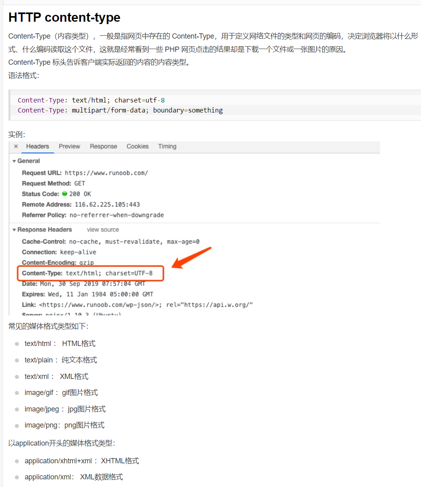


-p:post所带的文件，模拟的时候这个文件就需要在本地创建，模拟真实传递过来的文件

## 乐观锁解决秒杀超卖问题

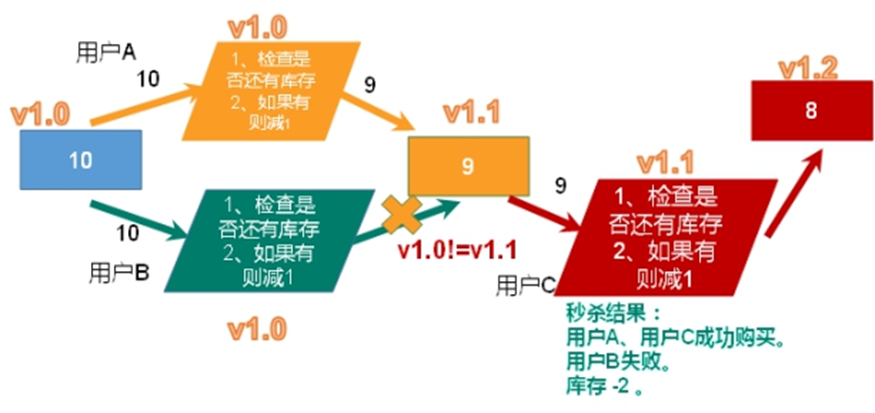

```java
//增加乐观锁
jedis.watch(qtkey);
 
//3.判断库存
String qtkeystr = jedis.get(qtkey);
if(qtkeystr==null || "".equals(qtkeystr.trim())) {
System.out.println("未初始化库存");
jedis.close();
return false ;
}
 
int qt = Integer.parseInt(qtkeystr);
if(qt<=0) {
System.err.println("已经秒光");
jedis.close();
return false;
}
 
//增加事务
Transaction multi = jedis.multi();
 
//4.减少库存
//jedis.decr(qtkey);
multi.decr(qtkey);
 
//5.加人
//jedis.sadd(usrkey, uid);
multi.sadd(usrkey, uid);
 
//执行事务
List<Object> list = multi.exec();
 
//判断事务提交是否失败
if(list==null || list.size()==0) {
System.out.println("秒杀失败");
jedis.close();
return false;
}
System.err.println("秒杀成功");
jedis.close();

```


## 连接池解决超时问题

节省每次连接redis服务带来的时间消耗，把连接好的实例反复利用。

通过参数管理连接的行为

代码见项目中

链接池参数

- MaxTotal：控制一个pool可分配多少个jedis实例，通过pool.getResource()来获取；如果赋值为-1，则表示不限制；如果pool已经分配了MaxTotal个jedis实例，则此时pool的状态为exhausted。
- maxIdle：控制一个pool最多有多少个状态为idle(空闲)的jedis实例；
- MaxWaitMillis：表示当borrow一个jedis实例时，最大的等待毫秒数，如果超过等待时间，则直接抛JedisConnectionException；
- testOnBorrow：获得一个jedis实例的时候是否检查连接可用性（ping()）；如果为true，则得到的jedis实例均是可用的；


## lua脚本代替乐观锁解决库存遗留问题

### 问题背景

如果秒杀请求的次数不够足够多，就会因为乐观锁的机制，导致一定数量请求失败，这就造成了库存遗留问题。于是我们弃用乐观锁，改用lua脚本进行操作，效果相当于悲观锁，但是实际上是让redis串行化执行命令，具体解释

### LUA脚本

Lua 是一个小巧的[脚本语言](http://baike.baidu.com/item/脚本语言)，Lua脚本可以很容易的被C/C++ 代码调用，也可以反过来调用C/C++的函数，Lua并没有提供强大的库，一个完整的Lua解释器不过200k，所以Lua不适合作为开发独立应用程序的语言，而是作为嵌入式脚本语言。

很多应用程序、游戏使用LUA作为自己的嵌入式脚本语言，以此来实现可配置性、可扩展性。

这其中包括魔兽争霸地图、魔兽世界、博德之门、愤怒的小鸟等众多游戏插件或外挂。

### LUA脚本在Redis中的优势

将**复杂的或者多步的redis操作，写为一个脚本，一次提交给redis执行，减少反复连接redis的次数。提升性能。**

LUA脚本是**类似redis事务**，有**一定的原子性**，**不会被其他命令插队**，可以完成一些redis事务性的操作,但不是悲观锁，算是一种**串行化执行**。

但是注意redis的lua脚本功能，只有在Redis 2.6以上的版本才可以使用。

**利用lua脚本淘汰用户，解决超卖问题。**

redis 2.6版本以后，通过lua脚本解决**争抢问题**，实际上是**redis** **利用其单线程的特性，用任务队列的方式解决多任务并发问题**。

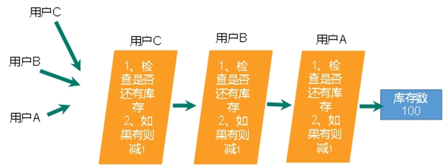

相当于把操作全写在一个lua脚本中，然后让redis利用单线程解决这些脚本中的命令，有其原子性

### 具体脚本

能看懂即可

```java
local userid=KEYS[1]; 
local prodid=KEYS[2];
local qtkey="sk:"..prodid..":qt";
local usersKey="sk:"..prodid.":usr'; 
local userExists=redis.call("sismember",usersKey,userid);
if tonumber(userExists)==1 then 
  return 2;
end
local num= redis.call("get" ,qtkey);
if tonumber(num)<=0 then 
  return 0; 
else 
  redis.call("decr",qtkey);
  redis.call("sadd",usersKey,userid);
end
return 1;

```


# Redis悲观锁、乐观锁和调用Lua脚本的优缺点

**悲观锁使用了数据库的锁机制，可以消除数据不一致性**，对于开发者而言会十分简单，**但是，使用悲观锁后，数据库的性能有所下降，因为大量的线程都会被阻塞，而且需要有大量的恢复过程，需要进一步改变算法以提高系统的并发能力。**

通过 CAS 原理和 ABA 问题的讨论，我们更加明确了乐观锁的原理，使用乐观锁有助于提高并发性能，但是由于版本号冲突，乐观锁导致多次请求服务失败的概率大大提高，而我们通过重入（按时间戳或者按次数限定）来提高成功的概率，这样对于乐观锁而言实现的方式就相对复杂了，其性能也会随着版本号冲突的概率提升而提升，并不稳定。

**使用乐观锁的弊端在于，导致大量的 SQL 被执行，对于数据库的性能要求较高，容易引起数据库性能的瓶颈，**而且对于开发还要考虑重入机制，从而导致开发难度加大。

**使用 Redis 去实现高并发，通过 Redis 提供的 Lua 脚本的原子性，消除了数据不一致性，并且在整个过程中只有最后一次涉及数据库，而且是使用了新的线程。**

在实际操作中更加倾向于使用 JMS 启动另外的服务器进行操作。但是这样使用的风险在于 Redis 的不稳定性，因为其事务和存储都存在不稳定的因素，所以更多的时候，建议使用独立 Redis 服务器做高并发业务，一方面可以提高 Redis 的性能，另一方面即使在高并发的场合，Redis 服务器宕机也不会影响现有的其他业务，同时也可以使用备机等设备提高系统的高可用，保证网站的安全稳定。


# 应用问题解决

## 缓存穿透


### 现象

***key*** 对应的数据在数据源并不存在，每次针对此 ***key*** 的请求从缓存获取不到，请求都会压到数据源（数据库），从而可能压垮数据源。

比如用一个不存在的用户 ***id*** 获取用户信息，不论缓存还是数据库都没有，若**黑客利用此漏洞进行攻击可能压垮数据库**。

造成：

1. **应用服务器压力变大**。
2. ***redis*** 命中率下降，就会开始查询数据库，徒增数据库压力 。


### 如何解决

- **对空值缓存**

  如果一个查询返回的数据为空（不管是数据是否不存在），仍然把这个空结果（***null***）进行缓存，设置空结果的过期时间会很短，最长不超过五分钟。

- **设置可访问的名单（白名单）：**

  使用 ***bitmaps*** 类型定义一个可以访问的名单，名单 ***id*** 作为 ***bitmaps*** 的偏移量，每次访问和 ***bitmap*** 里面的 ***id*** 进行比较，如果访问 ***id*** 不在 ***bitmaps*** 里面，进行拦截，则不允许访问。但是这样依然会多次访问redis缓存。

- **采用布隆过滤器**

  布隆过滤器（***Bloom Filter***）是1970年由布隆提出的。它实际上是一个很长的二进制向量（位图）和一系列随机映射函数（哈希函数）。

  布隆过滤器可以用于检索一个元素是否在一个集合中。它的优点是空间效率和查询时间都远远超过一般的算法，缺点是有一定的误识别率和删除困难。

  将所有可能存在的数据哈希到一个足够大的 ***bitmaps*** 中，一个一定不存在的数据会被这个 ***bitmaps*** 拦截掉，从而避免了对底层存储系统的查询压力。原理和设置名单差不多。

- **进行实时监控**

  当发现 ***Redis*** 的命中率开始急速降低，需要排查访问对象和访问的数据，和运维人员配合，可以设置黑名单限制服务，禁止ip。第一时间拨打网警。

## 缓存击穿


***key*** 对应的数据存在，但在 ***redis*** 中过期，此时若有大量并发请求过来，这些请求发现缓存过期一般都会从后端***DB*** 加载数据并回设到缓存，这个时候大并发的请求可能会瞬间把后端 ***DB*** 压垮。即某个经常访问的 ***key*** 过期，突然有大量访问这个数据

1. 数据库访问压力瞬间增大。
2. ***redis*** 中没有出现大量 ***key*** 过期，只是少量的key过期，***redis*** 正常运行。

### 如何解决

- 预先设置热门数据

  在 ***redis*** 高峰访问之前，把一些热门数据提前存入到 ***redis*** 里面，加大这些热门数据 ***key*** 的时长。

- 实时调整

  现场监控哪些数据热门，实时调整 ***key*** 的过期时长。

- 使用锁

  - 就是在缓存失效的时候（判断拿出来的值为空），不是立即去load db。

  - 先使用缓存工具的某些带成功操作返回值的操作（比如Redis的SETNX）去set一个mutex key

  - 当操作返回成功时，再进行load db的操作，并回设缓存,最后删除mutex key；

  - 当操作返回失败，证明有线程在load db，当前线程睡眠一段时间再重试整个get缓存的方法。

     


### 缓存穿透与击穿的区别

- 缓存穿透是指，大量查询不存在的缓存，缓存命中率下降，导致查询数据库，**没有起到缓冲压力的作用**
- 而缓存击穿是指，某个存在缓存失效，瞬时的并发打到数据库。


## 缓存雪崩

大量***key*** 对应的数据存在，但在 ***redis*** 中过期，此时若有大量并发请求过来，这些请求发现缓存过期一般都会从后端***DB*** 加载数据并回设到缓存，这个时候大并发的请求可能会瞬间把后端 ***DB*** 压垮。

### 如何解决

- **构建多级缓存架构**

  ***nginx*** 缓存 + ***redis*** 缓存 + 其他缓存（***ehcache***等）

- **使用锁或队列：**

  用加锁或者队列的方式保证来保证不会有大量的线程对数据库一次性进行读写，从而避免失效时大量的并发请求落到底层存储系统上。不适用高并发情况。

- **设置过期标志更新缓存：**

  记录缓存数据是否过期（设置提前量），如果过期会触发通知另外的线程在后台去更新实际 ***key*** 的缓存。

- **将缓存失效时间分散开：**

  比如我们可以在原有的失效时间基础上增加一个随机值，比如 1～5 分钟随机，这样每一个缓存的过期时间的重复率就会降低，就很难引发集体失效的事件。

### 缓存雪崩与缓存击穿的区别

缓存雪崩与缓存击穿的区别在于这里针对很多 ***key*** 缓存，前者则是某一个 ***key***。

1. 数据库压力变大。
2. 即极少的时间段，查询大量 ***key*** 的**集中过期**情况。

# 分布式锁

## 问题描述

​	随着业务发展的需要，原**单体单机部署的系统被演化成分布式集群系统后**，由于分布式系统多线程、多进程并且分布在不同机器上，这将使原单机部署情况下的**并发控制锁策略失效**，单纯的Java API并不能提供分布式锁的能力。为了解决这个问题就需要一种跨JVM的互斥机制来控制共享资源的访问，这就是分布式锁要解决的问题！

**分布式锁主流的实现方案**：

1. 基于数据库实现分布式锁

2. 基于缓存（Redis等）

3. 基于Zookeeper

每一种**分布式锁解决方案都有各自的优缺点**：

1. 性能：redis最高

2. 可靠性：zookeeper最高

这里，我们就基于redis实现分布式锁。

## 使用redis实现分布式锁

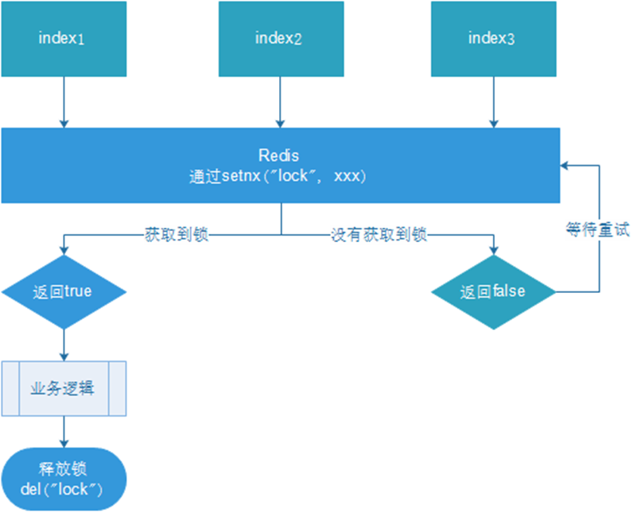

1. 多个客户端同时获取锁（setnx）

2. 获取成功，执行业务逻辑{从db获取数据，放入缓存}，执行完成释放锁（del）

3. 其他客户端等待重试

### 命令

```bash
set user "10" nx px 20

# EX second ：设置键的过期时间为 second 秒。 SET key value EX second 效果等同于 SETEX key second value 。
# PX millisecond ：设置键的过期时间为 millisecond 毫秒。 SET key value PX millisecond 效果等同于 PSETEX key millisecond value 。
# NX ：只在键不存在时，才对键进行设置操作。 SET key value NX 效果等同于 SETNX key value 。
# XX ：只在键已经存在时，才对键进行设置操作。

del user # 表示释放锁
```

### 编写Java代码

```java
@GetMapping("testLock")
public void testLock(){
    
     //***************************************************************//
    //1获取锁，setne
    Boo-lean lock = redisTemplate.opsForValue().setIfAbsent("lock", "111"，3，TimeUnit.SECONDS); //setnx,并且设置过期时间为3s，防止出现异常，无法释放锁
     //***************************************************************//
    
    //2获取锁成功、查询num的值
    if(lock){
        Object value = redisTemplate.opsForValue().get("num");
        //2.1判断num为空return
        if(StringUtils.isEmpty(value)){
            return;
        }
        //2.2有值就转成成int
        int num = Integer.parseInt(value+"");
        //2.3把redis的num加1
        redisTemplate.opsForValue().set("num", ++num);
        //2.4释放锁，del
        redisTemplate.delete("lock");

    }else{
        //3获取锁失败、每隔0.1秒再获取
        try {
            Thread.sleep(100);
            testLock();
        } catch (InterruptedException e) {
            e.printStackTrace();
        }
    }
}

```

### UUID防止误删

**问题：可能会释放其他服务器的锁**

> 场景：如果业务逻辑的执行时间是7s。执行流程如下
>
> 1. index1业务逻辑没执行完，3秒后锁被自动释放。
>
> 2. index2获取到锁，执行业务逻辑，3秒后锁被自动释放。
>
> 3. index3获取到锁，执行业务逻辑
>
> 4. index1业务逻辑执行完成，开始调用del释放锁，这时释放的是index3的锁，导致index3的业务只执行1s就被别人释放。
>
> 最终等于没锁的情况。

解决：**setnx获取锁时，设置对应value为一个指定的唯一值（例如：uuid）；释放前获取这个值，判断是否自己的锁**。这种方法设置的其实还是一个共享锁，因为前后加的锁的key值还是一样的，但是每个主机在删除的时候只能删除对应自己的uuid的key

于是我们优化以上的java代码

```java
@GetMapping("testLock")
public void testLock(){
    
     //***************************************************************//
    //0.1 设置value为uuid，
    String uuid = UUID.randomUUID().toString();
    //1获取锁，setne
    Boo-lean lock = redisTemplate.opsForValue().setIfAbsent("lock", uuid，3，TimeUnit.SECONDS); //setnx,并且设置过期时间为3s，防止出现异常，无法释放锁
     //***************************************************************//
    
    //2获取锁成功、查询num的值
    if(lock){
        Object value = redisTemplate.opsForValue().get("num");
        //2.1判断num为空return
        if(StringUtils.isEmpty(value)){
            return;
        }
        //2.2有值就转成成int
        int num = Integer.parseInt(value+"");
        //2.3把redis的num加1
        redisTemplate.opsForValue().set("num", ++num);
        
         //***************************************************************//
        if(uuid.equals((String)redisTemplate.opsForValue().get("lock"))){
            this.redisTemplate.delete("lock");
        }
         //***************************************************************//
        
        //2.4释放锁，del
        redisTemplate.delete("lock");

    }else{
        //3获取锁失败、每隔0.1秒再获取
        try {
            Thread.sleep(100);
            testLock();
        } catch (InterruptedException e) {
            e.printStackTrace();
        }
    }
}
```

### LUA保证删除原子性

场景:

> 1. index1执行删除时，查询到的lock值确实和uuid相等
>
> uuid=v1
>
> ​                               
>
> 2. index1执行删除前，lock刚好过期时间已到，被redis自动释放
>
> 在redis中没有了lock，没有了锁。
>
>  
>
> 3. index2获取了lock
>
> index2线程获取到了cpu的资源，开始执行方法
>
> uuid=v2
>
> set(lock,uuid)；
>
> 4. index1执行删除，此时会把index2的lock删除，index2就没有锁了

使用lua脚本优化java代码

**在业务操作结束和删除锁之间使用lua脚本操作来删除锁，保证原子性，防止被其他命令干扰,比如使锁过期的命令**

```java
@GetMapping("testLockLua")
public void testLockLua() {
    //1 声明一个uuid ,将做为一个value 放入我们的key所对应的值中
    String uuid = UUID.randomUUID().toString();
    //2 定义一个锁：lua 脚本可以使用同一把锁，来实现删除！
    String skuId = "25"; // 访问skuId 为25号的商品 100008348542
    String locKey = "lock:" + skuId; // 锁住的是每个商品的数据

    // 3 获取锁
    Boolean lock = redisTemplate.opsForValue().setIfAbsent(locKey, uuid, 3, TimeUnit.SECONDS);

    // 第一种： lock 与过期时间中间不写任何的代码。
    // redisTemplate.expire("lock",10, TimeUnit.SECONDS);//设置过期时间
    // 如果true
    if (lock) {
        // 执行的业务逻辑开始
        // 获取缓存中的num 数据
        Object value = redisTemplate.opsForValue().get("num");
        // 如果是空直接返回
        if (StringUtils.isEmpty(value)) {
            return;
        }
        // 不是空 如果说在这出现了异常！ 那么delete 就删除失败！ 也就是说锁永远存在！
        int num = Integer.parseInt(value + "");
        // 使num 每次+1 放入缓存
        redisTemplate.opsForValue().set("num", String.valueOf(++num));
        
        //***************************************************************//
        
        //在操作结束和删除锁之间进行lua操作，保证原子性，防止被其他命令干扰,比如使锁过期的命令
        /*使用lua脚本来锁*/
        // 定义lua 脚本
        String script = "if redis.call('get', KEYS[1]) == ARGV[1] then return redis.call('del', KEYS[1]) else return 0 end";
        // 使用redis执行lua执行
        DefaultRedisScript<Long> redisScript = new DefaultRedisScript<>();
        redisScript.setScriptText(script);
        // 设置一下返回值类型 为Long
        // 因为删除判断的时候，返回的0,给其封装为数据类型。如果不封装那么默认返回String 类型，
        // 那么返回字符串与0 会有发生错误。
        redisScript.setResultType(Long.class);
        // 第一个要是script 脚本 ，第二个需要判断的key，第三个就是key所对应的值。
        redisTemplate.execute(redisScript, Arrays.asList(locKey), uuid);
        
        //原子性删除完成************************************************//
        
    } else {
        // 其他线程等待
        try {
            // 睡眠
            Thread.sleep(1000);
            // 睡醒了之后，调用方法。
            testLockLua();
        } catch (InterruptedException e) {
            e.printStackTrace();
        }
    }
}

```

# Redis6.0新功能

## ACL

Redis ACL是Access Control List（访问控制列表）的缩写，该功能允许根据可以执行的命令和可以访问的键来限制某些连接。
在Redis 5版本之前，Redis 安全规则只有密码控制 还有通过rename 来调整高危命令比如 flushdb ， KEYS* ， shutdown 等。Redis 6 则提供ACL的功能对用户进行更细粒度的权限控制 ：
（1）接入权限:用户名和密码 
（2）可以执行的命令 
（3）可以操作的 KEY
参考官网：https://redis.io/topics/acl

## IO多线程

Redis6终于支撑多线程了，告别单线程了吗？
**IO多线程其实指客户端交互部分的网络IO交互处理模块多线程，而非执行命令多线程。Redis6执行命令依然是单线程**。

另外，**多线程IO默认也是不开启的**，需要再配置文件中配置
io-threads-do-reads  yes 
io-threads 4

## 工具支持Cluster

之前老版Redis想要搭集群需要单独安装ruby环境，Redis 5 将 redis-trib.rb 的功能集成到 redis-cli 。另外官方 redis-benchmark 工具开始支持 cluster 模式了，通过多线程的方式对多个分片进行压测。

## Redis新功能持续关注

Redis6新功能还有：
1、RESP3新的 Redis 通信协议：优化服务端与客户端之间通信
2、Client side caching客户端缓存：基于 RESP3 协议实现的客户端缓存功能。为了进一步提升缓存的性能，将客户端经常访问的数据cache到客户端。减少TCP网络交互。
3、Proxy集群代理模式：Proxy 功能，让 Cluster 拥有像单实例一样的接入方式，降低大家使用cluster的门槛。不过需要注意的是代理不改变 Cluster 的功能限制，不支持的命令还是不会支持，比如跨 slot 的多Key操作。
4、Modules API
Redis 6中模块API开发进展非常大，因为Redis Labs为了开发复杂的功能，从一开始就用上Redis模块。Redis可以变成一个框架，利用Modules来构建不同系统，而不需要从头开始写然后还要BSD许可。Redis一开始就是一个向编写各种系统开放的平台。
