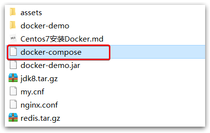

:::tip

本文适合观看过黑马相关视频的同学复习使用

视频地址：[黑马Docker视频](https://www.bilibili.com/video/BV1LQ4y127n4/?spm_id_from=333.1007.top_right_bar_window_custom_collection.content.click)

:::

# 初始Docker

## 学习背景

微服务虽然具备各种各样的优势，但服务的拆分通用给部署带来了很大的麻烦。

- 分布式系统中，依赖的组件非常多，不同组件之间部署时往往会产生一些冲突。
- 在数百上千台服务中重复部署，环境不一定一致，开发、测试、生产环境有差异，会遇到各种问题

### Docker解决依赖兼容问题

采用了两个手段：

- 将应用的Libs（函数库）、Deps（依赖）、配置与应用一起打包

- 将每个应用放到一个隔离**容器**去运行，避免互相干扰


### Docker解决操作系统环境差异

应用程序在计算机中交互的流程如下：

1）应用调用操作系统应用（函数库），实现各种功能

2）系统函数库是对内核指令集的封装，会调用内核指令

3）内核指令操作计算机硬件


Docker如何解决不同系统环境的问题？

- **Docker将用户程序与所需要调用的系统(比如Ubuntu)函数库一起打包**，不管实际的运行系统是Centos还是Ubuntu都可以正常运行，因为应用程序调用的是捆绑在一起的系统的函数，系统函数再调用linux内核的函数。
- Docker运行到不同操作系统时，直接基于打包的函数库，**只借助于操作系统的Linux内核来运行，不在乎实际运行的系统版本是什么**。


> Docker是一个快速交付应用、运行应用的技术，具备下列优势：
>
> - 可以**将程序及其依赖、运行环境一起打包为一个镜像，可以迁移到任意Linux操作系统**
> - 运行时**利用沙箱机制形成隔离容器**，各个应用**互不干扰**
> - 启动、移除都可以通过一行命令完成，方便快捷

> Docker和虚拟机的差异：
>
> - docker是一个系统进程；虚拟机是在操作系统中的操作系统
>
> - docker体积小、启动速度快、性能好；虚拟机体积大、启动速度慢、性能一般

## Docker架构

### 镜像和容器

**镜像（Image）**：Docker将应用程序及其所需的依赖、函数库、环境、配置等文件打包在一起，称为镜像。

**容器（Container）**：镜像中的应用程序运行后形成的进程就是**容器**，只是Docker会给容器进程做隔离，对外不可见。

> **镜像**就是把一个应用在硬盘上的文件、及其运行环境、部分系统函数库文件一起打包形成的文件包。这个文件包是只读的。
>
> **容器**就是将这些文件中编写的程序、函数加载到内存中允许，形成进程，只不过要隔离起来。因此一个镜像可以启动多次，形成多个容器进程。

### DockerHub

网址：https://hub.docker.com/

- DockerHub：DockerHub是一个官方的Docker镜像的托管平台。这样的平台称为Docker Registry。
- 国内也有类似于DockerHub 的公开服务，比如 [网易云镜像服务](https://c.163yun.com/hub)、[阿里云镜像库](https://cr.console.aliyun.com/)等。

### Docker架构

Docker是一个CS架构的程序，由两部分组成：

- 服务端(server)：Docker守护进程，负责处理Docker指令，管理镜像、容器等

- 客户端(client)：通过命令或RestAPI向Docker服务端发送指令。可以在本地或远程向服务端发送指令。


## 安装Docker

Docker 分为 CE 和 EE 两大版本。CE 即社区版（免费，支持周期 7 个月），EE 即企业版，强调安全，付费使用，支持周期 24 个月。

Docker CE 分为 `stable` `test` 和 `nightly` 三个更新频道。

官方网站上有各种环境下的 [安装指南](https://docs.docker.com/install/)，这里主要介绍 Docker CE 在 CentOS上的安装。

> Docker CE 支持 64 位版本 CentOS 7，并且要求内核版本不低于 3.10， CentOS 7 满足最低内核的要求，所以我们在CentOS 7安装Docker。

### 卸载（可选）

如果之前安装过旧版本的Docker，可以使用下面命令卸载：(`'\'`表示本行命令未结束，下一行继续，`'\'`前记得有一个空格)

```shell
yum remove docker \
                  docker-client \
                  docker-client-latest \
                  docker-common \
                  docker-latest \
                  docker-latest-logrotate \
                  docker-logrotate \
                  docker-selinux \
                  docker-engine-selinux \
                  docker-engine \
                  docker-ce
```

### 安装Docker

首先需要大家虚拟机联网，安装yum工具

```shell
yum install -y yum-utils \
           device-mapper-persistent-data \
           lvm2 --skip-broken
```

然后更新本地镜像源：

```shell
# 设置docker镜像源
yum-config-manager \
    --add-repo \
    https://mirrors.aliyun.com/docker-ce/linux/centos/docker-ce.repo
    
sed -i 's/download.docker.com/mirrors.aliyun.com\/docker-ce/g' /etc/yum.repos.d/docker-ce.repo

yum makecache fast
```

然后输入命令：

```shell
yum install -y docker-ce
```

docker-ce为社区免费版本。稍等片刻，docker即可安装成功。

### 启动docker

Docker应用需要用到各种端口，逐一去修改防火墙设置。非常麻烦，因此建议大家直接关闭防火墙！（企业里可不能这样搞--）

```sh
# 关闭
systemctl stop firewalld
# 禁止开机启动防火墙
systemctl disable firewalld
```

通过命令启动docker：

```sh
systemctl start docker  # 启动docker服务

systemctl stop docker  # 停止docker服务

systemctl restart docker  # 重启docker服务
```

然后输入命令，可以查看docker版本：

```
docker -v
```

如图，安装成功：


### 配置镜像加速

docker官方镜像仓库网速较差，我们需要设置国内镜像服务：

参考阿里云的镜像加速文档：https://cr.console.aliyun.com/cn-hangzhou/instances/mirrors


CentOS7安装方法：

#### 1. 安装／升级Docker客户端

推荐安装1.10.0以上版本的Docker客户端，参考文档[docker-ce](https://yq.aliyun.com/articles/110806)

#### 2. 配置镜像加速器

针对Docker客户端版本大于 1.10.0 的用户

您可以通过修改daemon配置文件/etc/docker/daemon.json来使用加速器

```shell
sudo mkdir -p /etc/docker
sudo tee /etc/docker/daemon.json <<-'EOF'
{
  "registry-mirrors": ["https://wjk0fz77.mirror.aliyuncs.com"]
}
EOF
sudo systemctl daemon-reload
sudo systemctl restart docker
```

# Docker的基本操作

## 镜像操作

### 镜像名称

首先来看下镜像的名称组成：

- 镜像名称一般分两部分组成：[repository]:[tag]。
- 在没有指定tag时，默认是latest，代表最新版本的镜像


### 镜像命令

常见的镜像操作命令如图：

docker build：通过Dockerfile构件镜像

> `docker build -t javaweb:1.0 .`
>
> -t:tag，后面跟镜像名称
>
> 最后的‘.’相当于'./'，代表本目录，意味着Dockerfile所在目录

docker pull：从镜像服务器拉取镜像，镜像服务器分为 公共镜像服务（DockerHub等）和私服

docker push：推送镜像到镜像服务器、

docker images：查看镜像

docker rmi [ImageName]：删除镜像

docker save -o [保存的目标文件名称] [镜像名称]: 把镜像保存为一个压缩包，供同事线下使用。

> docker save -o nginx.tar nginx:latest

docker load ：加载压缩包镜像

> docker load -i nginx.tar

docker xx --help：查看命令xx的语法


## 容器操作

**命令：**（下面案例有具体使用方法）

- docker run：创建并运行一个容器，处于运行状态
- docker pause：让一个运行的容器暂停
- docker unpause：让一个容器从暂停状态恢复运行
- docker stop：停止一个运行的容器
- docker start：让一个停止的容器再次运行

- docker rm：删除一个容器

- docker exec：进入容器（执行命令）

容器操作的命令如图：


容器保护三个状态：

- 运行：进程正常运行
- 暂停：进程暂停，挂起，CPU不再运行，并不释放内存
- 停止：进程终止，回收进程占用的内存、CPU等资源

### 案例

#### 创建并运行一个容器

创建并运行nginx容器的命令：

```sh
docker run --name containerName -p 80:80 -d nginx
```

命令解读：

- docker run ：创建并运行一个容器
- --name : 给容器起一个名字，比如叫做mn
- -p ：将宿主机端口与容器端口映射，冒号左侧是宿主机端口，右侧是容器端口。**外界可以访问宿主机的端口，从而映射到容器的端口。**
- -d：后台运行容器
- nginx：基于的镜像名称，例如nginx

> 这里的`-p`参数，是将容器端口映射到宿主机端口。
>
> 默认情况下，容器是隔离环境，我们直接访问宿主机的80端口，肯定访问不到容器中的nginx。
>
> 现在，将容器的80与宿主机的80关联起来，当我们访问宿主机的80端口时，就会被映射到容器的80，这样就能访问到nginx了。


#### 进入容器，修改文件

1.进入容器要用到docker exec命令。

```sh
docker exec -it mn bash
```

命令解读：

- docker exec ：进入容器内部，执行一个命令

- -it : 给当前进入的容器创建一个标准输入、输出终端，允许我们与容器交互

- mn ：要进入的容器的名称

- bash：进入容器后执行的命令，bash是一个linux终端交互命令

2.进入nginx的HTML所在目录

容器内部会模拟一个独立的Linux文件系统，看起来如同一个linux服务器一样：

查看DockerHub网站中的nginx页面，可以知道nginx的html目录位置在`/usr/share/nginx/html`

我们执行命令，进入该目录：

```sh
cd /usr/share/nginx/html
```

3.修改index.html的内容

容器内没有vi命令，无法直接修改，我们用下面的命令来修改（以后会把该文件挂载到宿主机文件系统上，通过修改宿主机文件即可更改）：

```sh
sed -i -e 's#Welcome to nginx#传智教育欢迎您#g' -e 's#<head>#<head><meta charset="utf-8">#g' index.html
```

在浏览器访问自己的虚拟机地址，即可看到结果。

## 数据卷（容器数据管理）

在之前的nginx案例中，修改nginx的html页面时，需要进入nginx内部。并且因为没有编辑器，修改文件也很麻烦。这就是因为**容器与数据（容器内文件）耦合**带来的后果。


要解决这个问题，必须将数据与容器解耦，这就要用到数据卷了。

### 什么是数据卷

**数据卷（volume）**是一个虚拟目录，指向宿主机文件系统中的某个目录。


一旦完成数据卷挂载，对容器的一切操作都会作用在数据卷对应的宿主机目录了。

这样，我们操作宿主机的/var/lib/docker/volumes/html目录，就等于操作容器内的/usr/share/nginx/html目录了

### 数据卷操作命令

数据卷操作的基本语法如下：

```sh
docker volume [COMMAND]
```

docker volume命令是数据卷操作，根据命令后跟随的COMMAND来确定下一步的操作：

- create 创建一个volume
- inspect 显示一个或多个volume的信息
- ls 列出所有的volume
- prune 删除未使用的volume（之前被容器使用过的，但是现在容器被删除了，也属于未使用的volume）
- rm 删除一个或多个指定的volume


**实例：创建一个数据卷，并查看数据卷在宿主机的目录位置**

① 创建数据卷html

```sh
docker volume create html
```

② 查看所有数据卷

```sh
docker volume ls
```

结果：


③ 查看数据卷详细信息卷

```sh
docker volume inspect html
```

结果：


可以看到，我们创建的html这个数据卷关联的宿主机目录为`/var/lib/docker/volumes/html/_data`目录。

### 挂载数据卷

我们在创建容器时，可以通过 -v 参数来挂载一个数据卷到某个容器内目录，命令格式如下：

```sh
docker run \
  --name mn \
  -v html:/root/html \
  -p 8080:80
  nginx \
```

这里的-v就是挂载数据卷的命令：

- `-v html:/root/htm` ：把html数据卷挂载到容器内的/root/html这个目录中

### 容器直接挂载到宿主机目录

容器不仅仅可以挂载数据卷，也可以直接挂载到宿主机目录上。关联关系如下：

- 带数据卷模式：宿主机目录 --> 数据卷 ---> 容器内目录
- 直接挂载模式：宿主机目录 ---> 容器内目录

如图：


**语法**：

目录挂载与数据卷挂载的语法是类似的：

- -v [宿主机目录]:[容器内目录]
- -v [宿主机文件]:[容器内文件]


**实例**：创建并运行一个MySQL容器，将宿主机目录直接挂载到容器

实现思路如下：

1）在将课前资料中的mysql.tar文件上传到虚拟机，通过load命令加载为镜像

2）创建目录/tmp/mysql/data

3）创建目录/tmp/mysql/conf，将课前资料提供的hmy.cnf文件上传到/tmp/mysql/conf

4）去DockerHub查阅资料，创建并运行MySQL容器，要求：

① 挂载/tmp/mysql/data到mysql容器内数据存储目录

② 挂载/tmp/mysql/conf/hmy.cnf到mysql容器的配置文件，但是因为提供的配置文件hmy.cnf是精简的，所以我们不能直接覆盖mysql的配置文件，官方提供给我们了一个目录，这个目录内的配置文件将来也会生效，具体的需要在DockerHub查阅

③ 设置MySQL密码


### 总结

数据卷挂载与目录直接挂载的

- 数据卷挂载耦合度低，由docker来管理目录，但是目录较深，不好找
- 目录挂载耦合度高，需要我们自己管理目录，不过目录容易寻找查看

# Dockerfile自定义镜像

常见的镜像在DockerHub就能找到，但是我们自己写的项目就必须自己构建镜像了。

Dockerfile用来描述镜像的构件步骤。

镜像就是在系统函数库、运行环境基础上，添加应用程序文件、配置文件、依赖文件等组合，然后编写好启动脚本打包在一起形成的文件。

## Dockerfile语法

**Dockerfile**就是一个文本文件，其中包含一个个的**指令(Instruction)**，用指令来说明要执行什么操作来构建镜像。每一个指令都会形成一层Layer。


更新详细语法说明，请参考官网文档： https://docs.docker.com/engine/reference/builder

## 构建Java项目

需求：基于Ubuntu镜像构建一个新镜像，运行一个java项目

步骤1：新建一个空文件夹docker-demo

步骤2：拷贝课前资料中的docker-demo.jar（要运行的java程序）文件到docker-demo这个目录

步骤3：拷贝课前资料中的jdk8.tar.gz（即jdk环境）文件到docker-demo这个目录

步骤4：拷贝课前资料提供的Dockerfile到docker-demo这个目录

其中的Dockerfile内容如下：

```dockerfile
# 指定基础镜像
FROM ubuntu:16.04
# 配置环境变量，JDK的安装目录
ENV JAVA_DIR=/usr/local

# 拷贝jdk和java项目的包
COPY ./jdk8.tar.gz $JAVA_DIR/
COPY ./docker-demo.jar /tmp/app.jar

# 安装JDK
RUN cd $JAVA_DIR \
 && tar -xf ./jdk8.tar.gz \
 && mv ./jdk1.8.0_144 ./java8

# 配置环境变量
ENV JAVA_HOME=$JAVA_DIR/java8
ENV PATH=$PATH:$JAVA_HOME/bin

# 暴露端口
EXPOSE 8090
# 入口，java项目的启动命令
ENTRYPOINT java -jar /tmp/app.jar
```

步骤5：将准备好的docker-demo上传到虚拟机任意目录，然后进入docker-demo目录

步骤6：运行命令：

```sh
docker build -t javaweb:1.0 .
```


最后访问 http://192.168.150.101:8090/hello/count，其中的ip改成你的虚拟机ip

## 基于java8构建Java项目

虽然我们可以基于Ubuntu基础镜像，添加任意自己需要的安装包，构建镜像，但是却**比较麻烦**。所以大多数情况下，我们都可以**在一些安装了部分软件的基础镜像上做改造**。

例如，构建java项目的镜像，可以**在已经准备了JDK的基础镜像基础上构建**。


需求：基于java:8-alpine镜像，将一个Java项目构建为镜像

实现思路如下：

- ① 新建一个空的目录，然后在目录中新建一个文件，命名为Dockerfile

- ② 拷贝课前资料提供的docker-demo.jar到这个目录中

- ③ 编写Dockerfile文件：

  - a ）基于java:8-alpine作为基础镜像

  - b ）将app.jar拷贝到镜像中

  - c ）暴露端口

  - d ）编写入口ENTRYPOINT

    内容如下：

    ```dockerfile
    FROM java:8-alpine
    COPY ./app.jar /tmp/app.jar
    EXPOSE 8090
    ENTRYPOINT java -jar /tmp/app.jar
    ```

- ④ 使用docker build命令构建镜像

- ⑤ 使用docker run创建容器并运行

## 小结

1. Dockerfile的本质是一个文件，通过指令描述镜像的构建过程

2. Dockerfile的第一行必须是FROM，从一个基础镜像来构建

3. 基础镜像可以是基本操作系统，如Ubuntu。也可以是其他人制作好的镜像，例如：java:8-alpine

# Docker-Compose

Docker-Compose可以基于Compose文件**帮我们快速的部署分布式应用**，而无需手动一个个创建和运行容器！


## 初识DockerCompose

Compose文件是一个文本文件，通过指令定义集群中的每个容器如何运行。格式如下：

**其实DockerCompose文件可以看做是将多个docker run命令写到一个文件，只是语法稍有差异。**

```json
version: "3.8"  //compose版本
 services:
  mysql:  //因为mysql只供我们本地调用，所以不对外接暴露端口，但是内部还是可以通过端口访问mysql
    image: mysql:5.7.25 
    environment:
     MYSQL_ROOT_PASSWORD: 123 //设置mysql密码
    volumes:  //挂载宿主机目录
     - "/tmp/mysql/data:/var/lib/mysql"
     - "/tmp/mysql/conf/hmy.cnf:/etc/mysql/conf.d/hmy.cnf"
  web:
    build: .  //由当前目录下的Dockerfile构建出的镜像
    ports:
     - "8090:8090"

```

上面的Compose文件就描述一个项目，其中包含两个容器：

- mysql：一个基于`mysql:5.7.25`镜像构建的容器，并且挂载了两个目录
- web：一个基于`docker build`临时构建的镜像容器，映射端口时8090


DockerCompose的详细语法参考官网：https://docs.docker.com/compose/compose-file/

## DockerCompose下载

### 1.Linux下需要通过命令下载：

```sh
# 安装
curl -L https://github.com/docker/compose/releases/download/1.23.1/docker-compose-`uname -s`-`uname -m` > /usr/local/bin/docker-compose
```

如果下载速度较慢，或者下载失败，可以使用课前资料提供的docker-compose文件：



上传到`/usr/local/bin/`目录也可以。

### 2.修改文件权限

修改文件权限：

```sh
# 修改权限 使用户可以执行该文件
chmod +x /usr/local/bin/docker-compose
```

### 3.自动补全命令：

```sh
# 补全命令 让我们在输入命令时有提示功能
curl -L https://raw.githubusercontent.com/docker/compose/1.29.1/contrib/completion/bash/docker-compose > /etc/bash_completion.d/docker-compose
```

如果这里出现错误，是因为CDN找不到ip，需要修改自己的hosts文件：

```sh
echo "199.232.68.133 raw.githubusercontent.com" >> /etc/hosts
```

## 部署微服务集群

**需求**：将之前学习的cloud-demo微服务集群利用DockerCompose部署

### 步骤

① 查看课前资料提供的cloud-demo文件夹，里面已经编写好了docker-compose文件，且**每个服务目录下都应该创建一个Dockerfile,用来构建镜像**

② **修改自己的cloud-demo项目，将数据库、nacos地址都命名为docker-compose中的服务名**，之前的都是localhost，部署到容器后如果不修改，将找不到对应服务

③ 使用maven打包工具，将项目中的每个微服务都打包为app.jar

④ 将打包好的app.jar拷贝到cloud-demo中的每一个对应的子目录中

⑤ 将cloud-demo上传至虚拟机，利用 **docker-compose up -d** 来部署

#### 1）compose文件

查看课前资料提供的cloud-demo文件夹，里面已经编写好了docker-compose文件，而且每个微服务都准备了一个独立的目录：


内容如下：

```yaml
version: "3.2"

services:
  nacos:
    image: nacos/nacos-server
    environment:
      MODE: standalone
    ports:
      - "8848:8848" # 因为要在浏览器查看nacos图形化管理界面，所以要暴露端口
  mysql:
    image: mysql:5.7.25
    environment:
      MYSQL_ROOT_PASSWORD: 123
    volumes:
      - "$PWD/mysql/data:/var/lib/mysql"
      - "$PWD/mysql/conf:/etc/mysql/conf.d/"
  userservice:
    build: ./user-service  # 相当于上边的image属性，并且没有配置其他属性，如环境变量等
  orderservice:
    build: ./order-service
  gateway:
    build: ./gateway
    ports:
      - "10010:10010"
```

可以看到，其中包含5个service服务：

- `nacos`：作为注册中心和配置中心
  - `image: nacos/nacos-server`： 基于nacos/nacos-server镜像构建
  - `environment`：环境变量
    - `MODE: standalone`：单点模式启动
  - `ports`：端口映射，这里暴露了8848端口
- `mysql`：数据库
  - `image: mysql:5.7.25`：镜像版本是mysql:5.7.25
  - `environment`：环境变量
    - `MYSQL_ROOT_PASSWORD: 123`：设置数据库root账户的密码为123
  - `volumes`：数据卷挂载，这里挂载了mysql的data、conf目录，其中有我提前准备好的数据
- `userservice`、`orderservice`、`gateway`：都是基于Dockerfile临时构建的


查看mysql目录，可以看到其中已经准备好了cloud_order、cloud_user表：


查看微服务目录，可以看到都包含Dockerfile文件：


内容都为如下：

```dockerfile
FROM java:8-alpine
COPY ./app.jar /tmp/app.jar
ENTRYPOINT java -jar /tmp/app.jar
```

> 为什么可以都是app.jar？
>
> 这是在每个服务的pom.xml中的build标签中配置的，可以在这个标签中配置打包的名称，这么多服务打包后的名称一样但不会冲突，因为不在同一个目录。

#### 2）修改微服务配置

因为微服务将来要部署为docker容器，而容器之间互联不是通过IP地址，而是通过容器名。这里我们将order-service、user-service、gateway服务的mysql、nacos地址都修改为基于容器名的访问。

如下所示：

```yaml
spring:
  datasource:
    url: jdbc:mysql://mysql:3306/cloud_order?useSSL=false
    username: root
    password: 123
    driver-class-name: com.mysql.jdbc.Driver
  application:
    name: orderservice
  cloud:
    nacos:
      server-addr: nacos:8848 # nacos服务地址
```


#### 3）打包

接下来需要将我们的每个微服务都打包。因为之前查看到Dockerfile中的jar包名称都是app.jar，因此我们的每个微服务都需要用这个名称。

可以通过修改pom.xml中的打包名称来实现，每个微服务都需要修改：

```xml
<build>
  <!-- 服务打包的最终名称 -->
  <finalName>app</finalName>
  <plugins>
    <plugin>
      <groupId>org.springframework.boot</groupId>
      <artifactId>spring-boot-maven-plugin</artifactId>
    </plugin>
  </plugins>
</build>
```

打包后：


#### 4）拷贝jar包到部署目录

编译打包好的app.jar文件，需要放到Dockerfile的同级目录中。注意：每个微服务的app.jar放到与服务名称对应的目录，别搞错了。

#### 5）部署

最后，我们需要将文件整个cloud-demo文件夹上传到虚拟机中，理由DockerCompose部署。

上传到任意目录：


部署：

进入cloud-demo目录，然后运行下面的命令：

```sh
docker-compose up -d
```

> 但是因为nacos部署较慢，user-service部署的时候会向nacos尝试注册，这时候nacos还没有部署完成，就会报错，并且user-service注册行为不会重试，所以建议先单独部署nacos，或者重启user-service等微服务

# Docker镜像仓库

## 搭建私有镜像仓库

搭建镜像仓库可以基于Docker官方提供的DockerRegistry来实现。

仓库本身也是一个容器。

官网地址：https://hub.docker.com/_/registry

### 简化版镜像仓库

Docker官方的Docker Registry是一个基础版本的Docker镜像仓库，具备仓库管理的完整功能，但是没有图形化界面(不常用)。

搭建方式比较简单，命令如下：

```sh
docker run -d \
    --restart=always \
    --name registry	\
    -p 5000:5000 \
    -v registry-data:/var/lib/registry \
    registry
```

命令中挂载了一个数据卷registry-data到容器内的/var/lib/registry 目录，这是私有镜像库存放数据的目录。

访问http://YourIp:5000/v2/_catalog 可以查看当前私有镜像服务中包含的镜像


### 带有图形化界面版本

使用DockerCompose部署带有图象界面的DockerRegistry，命令如下：

```yaml
version: '3.0'
services:
  registry:
    image: registry
    volumes:
      - ./registry-data:/var/lib/registry
  ui:
    image: joxit/docker-registry-ui:static
    ports:
      - 8080:80
    environment:
      - REGISTRY_TITLE=传智教育私有仓库
      - REGISTRY_URL=http://registry:5000
    depends_on:
      - registry
```


### 配置Docker信任地址

我们的私服采用的是http协议，默认不被Docker信任，所以需要做一个配置：

```sh
# 打开要修改的文件
vi /etc/docker/daemon.json
# 添加内容：
"insecure-registries":["http://192.168.150.101:8080"]
# 重加载
systemctl daemon-reload
# 重启docker
systemctl restart docker
```

## 推送、拉取镜像

推送镜像到私有镜像服务必须先tag，步骤如下：

① 重新tag本地镜像，名称前缀为私有仓库的地址：192.168.150.101:8080/

 ```sh
docker tag nginx:latest 192.168.150.101:8080/nginx:1.0 
 ```

② 推送镜像

```sh
docker push 192.168.150.101:8080/nginx:1.0 
```

③ 拉取镜像

```sh
docker pull 192.168.150.101:8080/nginx:1.0 
```


